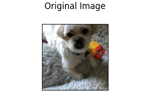
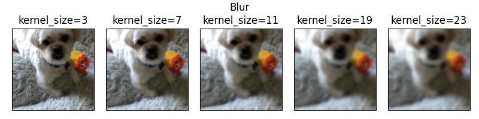

Input image features are transformed into a float valued tensors of size `N x C x H x W` (where `N` is the size of the
dataset, `C` is the number of channels, and `H x W` is the height and width of the image (can be specified by the user).
These tensors are added to HDF5 with a key that reflects the name of column in the dataset.

The column name is added to the JSON file, with an associated dictionary containing preprocessing information about the
sizes of the resizing.

# Supported Image Formats

The number of channels in the image is determined by the image format. The following table lists the supported image
formats and the number of channels.

| Format               | Number of channels |
| -------------------- | ------------------ |
| Grayscale            | 1                  |
| Grayscale with Alpha | 2                  |
| RGB                  | 3                  |
| RGB with Alpha       | 4                  |

# Image Features Preprocessing

During preprocessing, raw image files are transformed into numpy arrays and saved in the hdf5 format.

!!! note
    Images passed to an image encoder are expected to have the same size. If images are different sizes, by default they
    will be resized to the dimensions of the first image in the dataset. Optionally, a `resize_method` together with a
    target `width` and `height` can be specified in the feature preprocessing parameters, in which case all images will
    be resized to the specified target size.

### `height`

Image height in pixels. If set, images will be resized to the specified height using the `resize_method` parameter. If
unspecified, images will be resized to the size of the first image in the dataset.

- Default: `null`

### `width`

Image width in pixels. If set, images will be resized to the specified width using the `resize_method` parameter. If
unspecified, images will be resized to the size of the first image in the dataset.

- Default: `null`

### `num_channels`

Number of channels in the images. If specified, images will be read in the mode specified by the number of channels. If
not specified, the number of channels will be inferred from the image format of the first valid image in the dataset.

E.g., if `num_channels = 1`, any RGB images will be converted to Grayscale. If `num_channels = 3`, any images with 1
channel will be converted to RGB by repeating the channel 3 times.

- Default: `null`

### `resize_method`

The method to use for resizing images.

- Default: `crop_or_pad`
- Options:
  - `crop_or_pad`: If image is larger than the specified dimensions, crops images. If image is smaller, pads images
using edge padding
  - `interpolate`: Uses interpolation to resize images to the specified `width` and `height`

### `infer_image_num_channels`

If true, then the number of channels in the dataset is inferred from a sample of the first image in the dataset.

- Default: `true`

### `infer_image_dimensions`

If true, then the height and width of images in the dataset will be inferred from a sample of the first image in the
dataset. Each image that doesn't conform to these dimensions will be resized according to `resize_method`. If set to
`false`, then the height and width of images in the dataset will be specified by the user.

This parameter will have no effect if `width` and `height` are specified.

- Default: `true`

### `infer_image_max_height`

If `infer_image_dimensions` is set, this is used as the maximum height of the images in the dataset.

- Default: 256

### `infer_image_max_width`

If `infer_image_dimensions` is set, this is used as the maximum width of the images in the dataset.

- Default: 256

### `infer_image_sample_size`

The sample size used for inferring dimensions of images in `infer_image_dimensions`.

- Default: 100

### `standardize_image`

The scaling strategy for pixel values in the image.

- Default: `None`
- Options:
    - `None`: No modification to image pixel values.
    - `imagenet1k`: Normalizes pixel values based on the mean and standard deviation of images in ImageNet.

### `in_memory`

Defines whether image dataset will reside in memory during the training process or will be dynamically fetched from disk
(useful for large datasets). In the latter case a training batch of input images will be fetched from disk each training
iteration.

- Default: `true`

### `num_processes`

Specifies the number of processes to run for preprocessing images.

- Default: 1

!!! note
    Depending on the application, it is preferable not to exceed a size of `256 x 256` as bigger sizes will seldom provide a
    significant performance advantage. Larger images will considerably slow down training and inference and consume more
    memory, leading to memory overflows on machines with limited amounts of RAM or OOM (out-of-memory) on GPUs.

Example of a preprocessing specification:

```yaml
name: image_feature_name
type: image
preprocessing:
  missing_value_strategy: fill_with_const
  fill_value: 0.5
  height: 128
  width: 128
  num_channels: 3
  resize_method: interpolate
  scaling: pixel_normalization
  in_memory: true
  num_processes: 4
```

Preprocessing parameters can also be defined once and applied to all image input features using the [Type-Global Preprocessing](../defaults.md#type-global-preprocessing) section.

# Image Input Features and Encoders

The encoder parameters specified at the feature level are:

- `tied` (default `null`): name of another input feature to tie the weights of the encoder with. It needs to be the name of
a feature of the same type and with the same encoder parameters.
- `augmentation` (default `False`): specifies image data augmentation operations to generate synthetic training data.  More details on image augmentation can be found [here](#image-augmentation).

Example image feature entry in the input features list:

```yaml
name: image_column_name
type: image
tied: null
encoder: 
    type: stacked_cnn
```

The available encoder parameters are:

- `type` (default `stacked_cnn`): the possible values are `stacked_cnn`, `resnet`, `mlp_mixer`, `vit`, and [TorchVision Pretrained Image Classification models](#torchvision-pretrained-model-encoders).

Encoder type and encoder parameters can also be defined once and applied to all image input features using the [Type-Global Encoder](../defaults.md#type-global-encoder) section.

## Convolutional Stack Encoder (`stacked_cnn`)

Stack of 2D convolutional layers with optional normalization, dropout, and down-sampling pooling layers, followed by an
optional stack of fully connected layers.

Convolutional Stack Encoder takes the following optional parameters:

### `conv_layers`

A list of dictionaries containing the parameters of all the convolutional layers. The length of the list determines the
number of stacked convolutional layers and the content of each dictionary determines the parameters for a specific
layer. If a parameter for a layer is not specified in the dictionary, then the default value for the stacked CNN encoder
is used.

- Default: `null`
- Parameters for each layer:
  - `out_channels`: The number of output channels.
  - `kernel_size`: The size of the convolutional kernel.
  - `stride`: The stride of the convolutional kernel.
  - `padding`: The padding of the convolutional kernel.
  - `dilation`: The dilation of the convolutional kernel.
  - `groups`: The number of groups for grouped convolution.
  - `bias`: Whether to add a bias term to the convolution.
  - `padding_mode`: The padding mode to use for the convolution.
  - `norm`: The type of normalization to use for the convolution.
  - `norm_params`: Optional parameters for the normalization.
  - `activation`: The type of activation to use for the convolution.
  - `dropout`: The dropout probability to use for the convolution.
  - `pool_function`: The type of pooling function to use for the convolution.
  - `pool_kernel_size`: The size of the pooling kernel.
  - `pool_stride`: The stride of the pooling kernel.
  - `pool_padding`: The padding of the pooling kernel.
  - `pool_dilation`: The dilation of the pooling kernel.

### `num_conv_layers`

If `conv_layers` is `null`, this is the number of stacked convolutional layers. Each layer will use default parameters
for the convolutional layer.

- Default: `null`

!!! note
    If both `conv_layers` and `num_conv_layers` are `null`, `conv_layers` is set to the following default value:

    ```python
    conv_layers = [
      {
        kernel_size: 3,
        out_channels: 32,
        pool_kernel_size: 2,
      },
      {
        kernel_size: 3,
        out_channels: 64,
        pool_kernel_size: 2,
      },
    ]
    ```

### `out_channels`

Indicates the number of filters, and by consequence the output channels of the 2d convolution. If `out_channels` is not
already specified in `conv_layers` this is the default `out_channels` that will be used for each layer.

- Default: `32`

### `kernel_size`

An integer or pair of integers specifying the kernel size. A single integer specifies a square kernel, while a pair of
integers specifies the height and width of the kernel in that order (`[h, w]`). If a `kernel_size` is not specified in
`conv_layers` this `kernel_size` that will be used for each layer.

- Default: `3`

### `stride`

An integer or pair of integers specifying the stride of the convolution along the height and
width. If a `stride` is not already specified in `conv_layers`, specifies the default `stride` of the 2D convolutional
kernel that will be used for each layer.

- Default: `1`

### `padding`

An int, pair of ints `[h, w]`, or one of `valid`, `same` specifying the padding used for convolution kernels.

- Default: `valid`

### `dilation`

An int or pair of ints specifying the dilation rate to use for dilated convolution. If `dilation` is not already
specified in `conv_layers`, specifies the default `dilation` of the 2D convolutional kernel that will be used for each
layer.

- Default: `1`

### `groups`

Groups controls the connectivity between convolution inputs and outputs. When `groups = 1`, each output channel depends
on every input channel. When `groups > 1`, input and output channels are divided into `groups` separate groups, where
each output channel depends only on the inputs in its respective input channel group. `in_channels` and `out_channels`
must both be divisible by `groups`.

- Default: `1`

### `conv_bias`

If `bias` not already specified in `conv_layers`, specifies if the 2D convolutional kernel should have a bias term.

- Default: `true`

### `padding_mode`

If `padding_mode` is not already specified in `conv_layers`, specifies the default `padding_mode` of the 2D
convolutional kernel that will be used for each layer.

- Default: `zeros`
- Choices: `zeros`, `reflect`, `replicate`, `circular`

### `conv_norm`

 (default `null`): if a `norm` is not already specified in `conv_layers` this is the default `norm` that will
be used for each layer. It indicates the normalization applied to the activations and can be `null`, `batch` or `layer`.

### `conv_norm_params`

 (default `null`): parameters used if `conv_norm` is either `batch` or `layer`. For information on parameters
used with `batch` see [Torch's documentation on batch normalization](https://pytorch.org/docs/stable/generated/torch.nn.BatchNorm2d.html)
or for `layer` see [Torch's documentation on layer normalization](https://pytorch.org/docs/stable/generated/torch.nn.LayerNorm.html).

### `conv_activation`

 (default `relu`): if an `activation` is not already specified in `conv_layers` this is the default `activation` that
will be used for each layer. It indicates the activation function applied to the output.

### `conv_dropout`

 (default `0`): dropout rate

### `pool_function`

 (default `max`): `max` will use max pooling. Any of `average`, `avg` or `mean` will use average pooling.

### `pool_kernel_size`

 (default `2`): An integer or pair of integers specifying the pooling size. If `pool_kernel_size` is not specified in
`conv_layers` this is the default value that will be used for each layer.

### `pool_stride`

 (default `null`): An integer or pair of integers specifying the pooling stride, which is the factor by which the
pooling layer downsamples the feature map. Defaults to `pool_kernel_size`.

### `pool_padding`

 (default `0`): An integer or pair of ints specifying pooling padding `(h, w)`.

### `pool_dilation`

 (default `1`): An integer or pair of ints specifying pooling dilation rate `(h, w)`.

### `fc_layers`

 (default `null`): a list of dictionaries containing the parameters of all the fully connected layers. The length of the
list determines the number of stacked fully connected layers and the content of each dictionary determines the
parameters for a specific layer. The available parameters for each layer are: `activation`, `dropout`, `norm`,
`norm_params`, `output_size`, `use_bias`, `bias_initializer` and `weights_initializer`. If any of those values is
missing from the dictionary, the default one specified as a parameter of the encoder will be used instead.

### `num_fc_layers`

 (default `1`): The number of stacked fully connected layers.

### `output_size`

 (default `256`): if `output_size` is not already specified in `fc_layers` this is the default `output_size` that will
be used for each layer. It indicates the size of the output of a fully connected layer.

### `fc_use_bias`

 (default `true`): boolean, whether the layer uses a bias vector.

### `fc_weights_initializer`

 (default `xavier_uniform`): initializer for the weights matrix. Options are: `constant`, `identity`, `zeros`, `ones`,
`orthogonal`, `normal`, `uniform`, `truncated_normal`, `variance_scaling`, `glorot_normal`, `glorot_uniform`,
`xavier_normal`, `xavier_uniform`, `he_normal`, `he_uniform`, `lecun_normal`, `lecun_uniform`. Alternatively it is
possible to specify a dictionary with a key `type` that identifies the type of initializer and other keys for its
parameters, e.g. `{type: normal, mean: 0, stddev: 0}`. To know the parameters of each initializer, please refer to
[torch.nn.init](https://pytorch.org/docs/stable/nn.init.html).

### `fc_bias_initializer`

 (default `'zeros'`): initializer for the bias vector. Options are: `constant`, `identity`, `zeros`, `ones`,
`orthogonal`, `normal`, `uniform`, `truncated_normal`, `variance_scaling`, `glorot_normal`, `glorot_uniform`,
`xavier_normal`, `xavier_uniform`, `he_normal`, `he_uniform`, `lecun_normal`, `lecun_uniform`. Alternatively it is
possible to specify a dictionary with a key `type` that identifies the type of initializer and other keys for its
parameters, e.g. `{type: normal, mean: 0, stddev: 0}`. To know the parameters of each initializer, please refer to
[torch.nn.init](https://pytorch.org/docs/stable/nn.init.html).

### `fc_norm`

 (default `null`): if a `norm` is not already specified in `fc_layers` this is the default `norm` that will be used for
each layer. It indicates the norm of the output and can be `null`, `batch` or `layer`.

### `fc_norm_params`

 (default `null`): parameters used if `norm` is either `batch` or `layer`.  For information on parameters used with
`batch` see [Torch's documentation on batch normalization](https://pytorch.org/docs/stable/generated/torch.nn.BatchNorm1d.html)
or for `layer` see [Torch's documentation on layer normalization](https://pytorch.org/docs/stable/generated/torch.nn.LayerNorm.html).

### `fc_activation`

 (default `relu`): : if an `activation` is not already specified in `fc_layers` this is the default `activation` that
will be used for each layer. It indicates the activation function applied to the output.

### `fc_dropout`

 (default `0`): dropout rate

Example image feature config using a convolutional stack encoder:

```yaml
name: image_column_name
type: image
preprocessing:  # example pre-processing
    height: 32
    width: 32
    num_channels: 1
encoder: 
    type: stacked_cnn
    conv_layers: null
    num_conv_layers: null
    kernel_size: 3
    out_channels: 256
    padding: valid
    conv_use_bias: true
    conv_norm: batch
    conv_activation: relu
    conv_dropout: 0
    pool_function: max
    num_fc_layers: 1
    output_size: 256
    fc_use_bias: true
    fc_weights_initializer: xavier_uniform
    fc_bias_initializer: zeros
    fc_norm: batch
    fc_activation: relu
    fc_dropout: 0
```

## ResNet Encoder

DEPRECATED: This encoder is deprecated and will be removed in a future release. Please use the equivalent 
TorchVision encoder instead.

Implements ResNet V2 as described in [Identity Mappings in Deep Residual Networks](https://arxiv.org/abs/1603.05027).

The ResNet encoder takes the following optional parameters:

- `resnet_size` (default `50`): The ResNet size, one of: `8`, `14`, `18`, `34`, `50`, `101`, `152`, `200`.
- `num_filters` (default `16`): The number of filters, and by consequence the output channels of the 2d convolution.
- `kernel_size` (default `3`): An integer or pair of integers specifying the convolution kernel size. A single integer
specifies a square kernel, a pair of integers specifies the height and width of the kernel in that order (`[h, w]`).
- `conv_stride` (default `1`): An integer or pair of integers specifying the stride of the initial convolutional layer.
- `first_pool_kernel_size` (default `null`): Pool size to be used for the first pooling layer. If none, the first
pooling layer is skipped.
- `first_pool_stride` (default `null`): Stride for first pooling layer. If `null`, defaults to `first_pool_kernel_size`.
- `batch_norm_momentum` (default `0.9`): Momentum of the batch norm running statistics.
- `batch_norm_epsilon` (default `0.001`): Epsilon of the batch norm.
- `fc_layers` (default `null`): a list of dictionaries containing the parameters of all the fully connected
layers. The length of the list determines the number of stacked fully connected layers and the content of each
dictionary determines the parameters for a specific layer. The available parameters for each layer are: `activation`,
`dropout`, `norm`, `norm_params`, `output_size`, `use_bias`, `bias_initializer` and `weights_initializer`. If any of
those values is missing from the dictionary, the default one specified as a parameter of the encoder will be used
instead.
- `num_fc_layers` (default `1`): The number of stacked fully connected layers.
- `output_size` (default `256`): if `output_size` is not already specified in `fc_layers` this is the default
`output_size` that will be used for each layer. It indicates the size of the output of a fully connected layer.
- `weights_initializer` (default `xavier_uniform`): initializer for the weights matrix. Options are: `constant`,
`identity`, `zeros`, `ones`, `orthogonal`, `normal`, `uniform`, `truncated_normal`, `variance_scaling`, `glorot_normal`,
`glorot_uniform`, `xavier_normal`, `xavier_uniform`, `he_normal`, `he_uniform`, `lecun_normal`, `lecun_uniform`.
To see the parameters of each initializer, please
refer to [torch.nn.init](https://pytorch.org/docs/stable/nn.init.html).
- `bias_initializer` (default `zeros`):  initializer for the bias vector. Options are: `constant`, `identity`, `zeros`,
`ones`, `orthogonal`, `normal`, `uniform`, `truncated_normal`, `variance_scaling`, `glorot_normal`, `glorot_uniform`,
`xavier_normal`, `xavier_uniform`, `he_normal`, `he_uniform`, `lecun_normal`, `lecun_uniform`. Alternatively it is
possible to specify a dictionary with a key `type` that identifies the type of initializer and other keys for its
parameters, e.g. `{type: normal, mean: 0, stddev: 0}`. To know the parameters of each initializer, please refer to
[torch.nn.init](https://pytorch.org/docs/stable/nn.init.html).
- `norm` (default `null`): if a `norm` is not already specified in `fc_layers` this is the default `norm` that will be
used for each layer. It indicates the norm of the output and it can be `null`, `batch` or `layer`.
- `norm_params` (default `null`): parameters used if `norm` is either `batch` or `layer`.  For information on parameters
used with `batch` see [Torch's documentation on batch normalization](https://pytorch.org/docs/stable/generated/torch.nn.BatchNorm1d.html)
or for `layer` see [Torch's documentation on layer normalization](https://pytorch.org/docs/stable/generated/torch.nn.LayerNorm.html).
- `activation` (default `relu`): if an `activation` is not already specified in `fc_layers` this is the default
`activation` that will be used for each layer. It indicates the activation function applied to the output.
- `dropout` (default `0`): dropout rate

Example image input feature config using a ResNet encoder:

```yaml
name: image_column_name
type: image
preprocessing:
    height: 224
    width: 224
    num_channels: 3
encoder: 
    type: resnet
    resnet_size: 50
    num_filters: 16
    kernel_size: 3
    conv_stride: 1
    batch_norm_momentum: 0.9
    batch_norm_epsilon: 0.001
    num_fc_layers: 1
    output_size: 256
    use_bias: true
    weights_initializer: glorot_uniform
    bias_initializer: zeros
    norm: null
    norm_params: null
    activation: relu
    dropout: 0
```

## MLP-Mixer Encoder

Encodes images using MLP-Mixer, as described in [MLP-Mixer: An all-MLP Architecture for Vision](https://arxiv.org/abs/2105.01601).
MLP-Mixer divides the image into equal-sized patches, applying fully connected layers to each patch to compute per-patch
representations (tokens) and combining the representations with fully-connected mixer layers.

The MLP-Mixer Encoder takes the following optional parameters:

- `patch_size` (default `16`): The image patch size. Each patch is `patch_size`² pixels. Must evenly divide
the image width and height.
- `embed_size` (default `512`): The patch embedding size, the output size of the mixer if `avg_pool` is true.
- `token_size` (default `2048`): The per-patch embedding size.
- `channel_dim` (default `256`): Number of channels in hidden layer.
- `num_layers` (default `8`): The depth of the network (the number of Mixer blocks).
- `dropout` (default `0`): Dropout rate.
- `avg_pool` (default `true`): If true, pools output over patch dimension, outputs a vector of shape `(embed_size)`. If
false, the output tensor is of shape `(n_patches, embed_size)`, where n_patches is
`img_height` x `img_width` / `patch_size`².

Example image feature config using an MLP-Mixer encoder:

```yaml
name: image_column_name
type: image
preprocessing:
    height: 64
    width: 64
    num_channels: 3
encoder:
    type: mlp_mixer
    patch_size: 16
    embed_size: 512
    token_size: 2048
    channel_dim: 256
    num_layers: 8
    dropout: 0.0
    avg_pool: True
```

## Vision Transformer Encoder

DEPRECATED: This encoder is deprecated and will be removed in a future release. Please use the equivalent 
TorchVision encoder instead.

Encodes images using a Vision Transformer as described in
[An Image is Worth 16x16 Words: Transformers for Image Recognition at Scale](https://arxiv.org/abs/2010.11929).

Vision Transformer divides the image into equal-sized patches, uses a linear transformation to encode each flattened
patch, then applies a deep transformer architecture to the sequence of encoded patches.

The Vision Transformer Encoder takes the following optional parameters:

- `use_pretrained` (default `true`): Use pre-trained model weights from Hugging Face.
- `pretrained_model` (default `google/vit-base-patch16-224`): The pre-trained model to use. See the
[model hub](https://huggingface.co/models?search=vit) for other pretrained vision transformer models.
- `hidden_size` (default `768`): Dimensionality of the encoder layers and the pooling layer.
- `num_hidden_layers` (default `12`): Number of hidden layers in the Transformer encoder.
- `num_attention_heads` (default `12`): Number of attention heads in each attention layer.
- `intermediate_size` (default `3072`): Dimensionality of the intermediate (i.e., feed-forward) layer in the Transformer
encoder.
- `hidden_act` (default `gelu`): Hidden layer activation, one of `gelu`, `relu`, `selu` or `gelu_new`.
- `hidden_dropout_prob` (default `0.1`): The dropout rate for all fully connected layers in the embeddings, encoder, and
pooling.
- `attention_probs_dropout_prob` (default `0.1`): The dropout rate for the attention probabilities.
- `initializer_range` (default `0.02`): The standard deviation of the truncated_normal_initializer for initializing all
weight matrices.
- `layer_norm_eps` (default `1e-12`): The epsilon used by the layer normalization layers.
- `gradient_checkpointing` (default `false`):
- `patch_size` (default `16`): The image patch size. Each patch is `patch_size`² pixels. Must evenly divide
the image width and height.
- `trainable` (default `true`): Is the encoder trainable.

Example image feature config using an MLP-Mixer encoder:

```yaml
name: image_column_name
type: image
preprocessing:
    height: 128
    width: 128
    num_channels: 3
encoder: 
    type: vit
    use_pretrained: true
```

## TorchVision Pretrained Model Encoders

Twenty TorchVision pretrained image classification models are available as Ludwig image encoders.  The available models 
are `AlexNet`, `ConvNeXt`, `DenseNet`, `EfficientNet`, `EfficientNetV2`, `GoogLeNet`, `Inception V3`, `MaxVit`, 
`MNASNet`, `MobileNet V2`, `MobileNet V3`, `RegNet`, `ResNet`, `ResNeXt`, `ShuffleNet V2`, `SqueezeNet`, 
`SwinTransformer`, `VGG`, `VisionTransformer`, `Wide ResNet`.  
See [TorchVison documentation](https://pytorch.org/vision/stable/models.html#classification) for more details.

Ludwig encoders parameters for TorchVisoin pretrained models:

- `type`: Specifies the TorchVision model to use as an image encoder. See following table for valid values.
- `model_variant` (default varies by model `type`): specifies the architecture for the specified encoder `type`. 
See following table for valid values for each model `type`.
- `use_pretrained` (default `true`): Use pre-trained model weights from TorchVision (`true`) or create a encoder with
randomly initialized weights for training from scratch (`false`).
- `pretrained_cache_dir`(default `None`): Specifies location to cache downloaded pretrained weights.  `None` indicates
the TorchVision default location.
- `trainable` (default `true`): Indicates whether the encoder parameters should be updated during training (`true`) 
or frozen (`false`).

**Table of encoder `type` and `model_variant`**

| Model ( Encoder `type`)                    | Encoder `model_variant`                                                                                                                                               |
|--------------------------------------------|-----------------------------------------------------------------------------------------------------------------------------------------------------------------------|
| AlexNet (`alexnet`)                  | `base` (default)                                                                                                                                                      |
| ConvNext (`convnext`)                | `tiny` (default), `small`, `base`, `large`                                                                                                                            |
| DenseNet (`densenet`)                | `121` (default), `161`, `169`, `201`                                                                                                                                  |
| EfficientNet (`efficientnet`)        | `b0` (default), `b1`, `b2`, `b3`, `b4`, `b5`, `b6`, `b7`                                                                                                              |
| EfficientNet V2 (`efficientnet`)     | `v2_s`, `v2_m`, `v2_l`                                                                                                                                                |
| GoogLeNet (`googlenet`)              | `base` (default)                                                                                                                                                      |
| Inception V3 (`inceptionv3`)         | `base` (default)                                                                                                                                                      |
| MaxViT (`maxvit`)                    | `t` (default)                                                                                                                                                         |
| MNASNet (`mnasnet`)                  | `0_5` (default), `0_75`, `1_0`, `1_3`                                                                                                                                 |
| MobileNet V2 (`mobilenetv2`)         | `base` (default)                                                                                                                                                      |
| MobileNet V3 (`mobilenetv3`)         | `small` (default), `large`                                                                                                                                            |
| RegNet (`regnet`)                    | `x_1_6gf` (default), `x_16gf`, `x_32gf`, `x_3_2gf`, `x_400mf`, `x_800mf`, `x_8gf`, `y_128gf`, `y_16gf`, `y_1_6gf`, `y_32gf`, `y_3_2gf`, `y_400mf`, `y_800mf`, `y_8gf` |
| ResNet (`resnet`)                    | `18` (default), `34`, `50`, `101`, `152`                                                                                                                              |
| ResNeXt (`resnext`)                  | `50_32x4d` (default), `101_32x8d `,`101_64x4d`                                                                                                                        |
| ShuffleNet V2 (`shufflenet_v2`)      | `x0_5` (default), `x1_0`, `x1_5`,`x2_0`                                                                                                                               |
| SqueezeNet (`squeezenet`)            | `1_0` (default), `1_1`                                                                                                                                                |
| SwinTransformer (`swin_transformer`) | `t` (default), `s`, `b`                                                                                                                                               |
| VGG (`vgg`)                          | `11` (default), `13`, `16`, `19`, `11_bn`, `13_bn`, `16_bn`, `19_bn`                                                                                                  |
| Vision Transformer (`vit`)           | `b_16` (default), `b_32`, `l_16`, `l_32`, `h_14`                                                                                                                      |
| Wide ResNet (`wide_resnet`)          | `50_2` (default), `101_2`                                                                                                                                             |


Example of image feature configuration using the TorchVision ResNet model:

```yaml
name: image_column_name
type: image
encoder: 
    type: resnet
    model_variant: 18
    use_pretrained: true
    pretrained_cache_dir: None
    trainable: true
```

**Note**: 

* At this time Ludwig supports only the `DEFAULT` pretrained weights, which are the best available weights for a specific
model. More details on `DEFAULT` weights can be found in this 
[blog post](https://pytorch.org/blog/introducing-torchvision-new-multi-weight-support-api/).
* Some TorchVision pretrained models consume large amounts of memory.  These `model_variant` required more than 
12GB of memory:
    * `efficientnet_torch`: `b7`
    * `regnet_torch`: `y_128gf`
    * `vit_torch`: `h_14`


## Image Augmentation

Image augmentation is a technique used to increase the diversity of a training dataset by applying random
transformations to the images.  The goal is to train a model that is robust to the variations in the training data.

Augmentation is specified by the `augmentation` section in the image feature configuration and can be specified in one of the following ways:

**Boolean: `False` (Default)** No augmentation is applied to the images.
```yaml
augmentation: False
```

**Boolean: `True`** The following augmentation methods are applied to the images: random_horizontal_flip and random_rotate.
```yaml
augmentation: True
```
**List of Augmentation Methods** One or more of the following augmentation methods are applied to the images in the order specified by the user: random_horizontal_flip, random_vertical_flip, random_rotate, random_blur, random_brightness, and random_contrast.
```yaml
augmentation:
    - type: random_horizontal_flip
    - type: random_vertical_flip
    - type: random_rotate
      degree: 10
    - type: random_blur
      kernel_size: 3
    - type: random_brightness
      min_brightness: 0.5
      max_brightness: 2.0
    - type: random_contrast
      min_contrast: 0.5
      max_contrast: 2.0
```

Following illustrates how augmentation affects an image:



**Horizontal Flip**: Image is randomly flipped horizontally.

```yaml
augmentation:
    - type: random_horizontal_flip
```


    
**Vertical Flip**:  Image is randomly flipped vertically.

```yaml
augmentation:
    - type: random_vertical_flip
```


**Rotate**: Image is randomly rotated by an amount in the range [-degree, +degree].  `degree` must be a positive integer.

``
    
```yaml
augmentation:
    - type: random_rotate
      degree: 45
```

Following shows the effect of rotating an image:


**Blur**:  Image is randomly blurred using a Gaussian filter with kernel size specified by the user.  The `kernel_size` must be a positive, odd integer.

`

```yaml
augmentation:
    - type: random_blur
      kernel_size: 3
```

Following shows the effect of blurring an image with various kernel sizes:



**Adjust Brightness**: Image brightness is adjusted by a factor randomly selected in the range [min_brightness, max_brightness].   Both `min_brightness` and `max_brightness` must be a float greater than 0, with `min_brightness` less than `max_brightness`.

```yaml
augmentation:
    - type: random_brightness
      min_brightness: 0.5
      max_brightness: 2.0
```

Following shows the effect of brightness adjustment with various factors:


**Adjust Contrast**: Image contrast is adjusted by a factor randomly selected in the range [min_contrast, max_contrast].  Both `min_contrast` and `max_contrast` must be a float greater than 0, with `min_contrast` less than `max_contrast`.

```yaml
augmentation:
    - type: random_contrast
      min_contrast: 0.5
      max_contrast: 2.0
```

Following shows the effect of contrast adjustment with various factors:


**Illustrative Examples of Image Feature Configuration with Augmentation**

```yaml
name: image_column_name
type: image
encoder: 
    type: resnet
    model_variant: 18
    use_pretrained: true
    pretrained_cache_dir: None
    trainable: true
augmentation: false
```

```yaml
name: image_column_name
type: image
encoder: 
    type: stacked_cnn
augmentation: true
```

```yaml
name: image_column_name
type: image
encoder: 
    type: alexnet
augmentation:
    - type: random_horizontal_flip
    - type: random_rotate
      degree: 10
    - type: random_blur
      kernel_size: 3
    - type: random_brightness
      min_brightness: 0.5
      max_brightness: 2.0
    - type: random_contrast
      min_contrast: 0.5
      max_contrast: 2.0
    - type: random_vertical_flip
```

# Image Output Features and Decoders

There are no image decoders at the moment (WIP), so image cannot be used as output features.

# Image Features Measures

As no image decoders are available at the moment, there are also no image measures.
