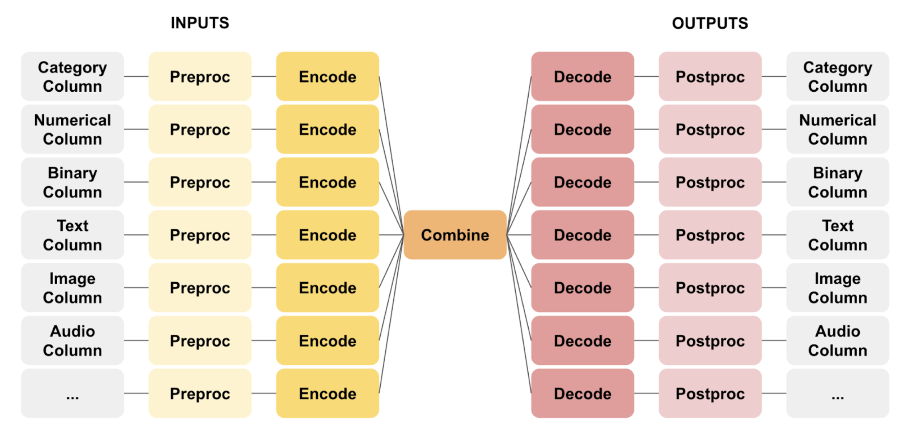

The Ludwig configuration's `input_features` section is list of feature definitions. Each feature definition contains two
required fields: `name` and `type`.

=== "YAML"

    ```yaml
    input_features:
        -
            name: Pclass
            type: category
    ```

=== "Python Dict"

    ```python
    {
        "input_features": [{"name": "Pclass", "type": "category"}]
    }
    ```

`name` is the name of the feature in the dataset. `type` is one of the
[supported data types](../supported_data_types).

# Preprocessing

Recall Ludwig's butterfly framework.



Each input feature can specify its own preprocessing via the `preprocessing` sub-section.

=== "YAML"

    ```yaml
    input_features:
        -
            name: Fare
            type: number
            preprocessing:
                missing_value_strategy: fill_with_mean
    ```

=== "Python Dict"

    ```python
    {
        "input_features": [
            {
                "name": "Fare",
                "type": "number",
                "preprocessing": {
                    "missing_value_strategy": "fill_with_mean"
                }
            }
        ]
    }
    ```

Also, see [type-global preprocessing](../preprocessing.md).

# Encoders

Each input feature can configure a specific `encoder` to map input feature values into tensors. For instance, a user
might want to encode a `sequence` feature using a `transformer` or an `image` feature using a `stacked_cnn`. Different
data types support different encoders. Check the documentation for specific feature types to see what encoders are
supported for that type.

All the other parameters besides `name`, `type`, and `preprocessing`, will be passed as parameters to the function that
build the input feature's encoder, and each encoder can have different parameters. Extensive documentation for all of
the encoders that can be used for a certain data type can also be found in each data type's documentation.

=== "YAML"

    ```yaml
    input_features:
        -
            name: text
            type: text
            encoder: bert
            level: word
            preprocessing:
                word_tokenizer: space
            reduce_output: null
            trainable: true
    ```

=== "Python Dict"

    ```python
    {
        "input_features": [
            {
                "name": "text",
                "type": "text",
                "encoder": "bert",
                "level": "word",
                "preprocessing": {
                    "word_tokenizer": "space"
                },
                "reduce_output": None,
                "trainable": True
            }
        ]
    }
    ```

Encoders map raw feature values into tensors. These are usually vectors in the case of data types without a temporal /
sequential aspect, matrices for when there is a temporal / sequential aspect, or higher rank tensors for when there is a
spatial or a spatiotemporal aspect to the input data.

Different configurations of the same encoder may return a tensor with different rank, for instance a sequential encoder
may return a vector of size `h` that is either the final vector of a sequence or the result of pooling over the sequence
length, or it can return a matrix of size `l x h` where `l` is the length of the sequence and `h` is the hidden
dimension if you specify the pooling reduce operation (`reduce_output`) to be `None`.  For the sake of simplicity you
can imagine the output to be a vector in most of the cases, but there is a `reduce_output` parameter one can specify to
change the default behavior.

For first-time users, we recommend starting with the defaults.

# Tying encoder weights

An additional feature that Ludwig provides is the option to have **tied weights** between different encoders.
For instance, if my model takes two sentences as input and return the probability of their entailment, I may want to
encode both sentences with the same encoder.

The way to do it is by specifying the `tied_weights` parameter of the second feature you define to be the name of the
first feature you defined. For example:

=== "YAML"

    ```yaml
    input_features:
        -
            name: sentence1
            type: text
        -
            name: sentence2
            type: text
            tied_weights: sentence1
    ```

=== "Python Dict"

    ```python
    {
        "input_features": [
            {
                "name": "sentence1",
                "type": "text"
            },
            {
                "name": "sentence2",
                "type": "text",
                "tied_weights": "sentence1"
            }
        ]
    }
    ```

Specifying a name of a non-existent input feature will result in an error. Also, in order to be able to have tied
weights, all encoder parameters have to be identical between the two input features.
