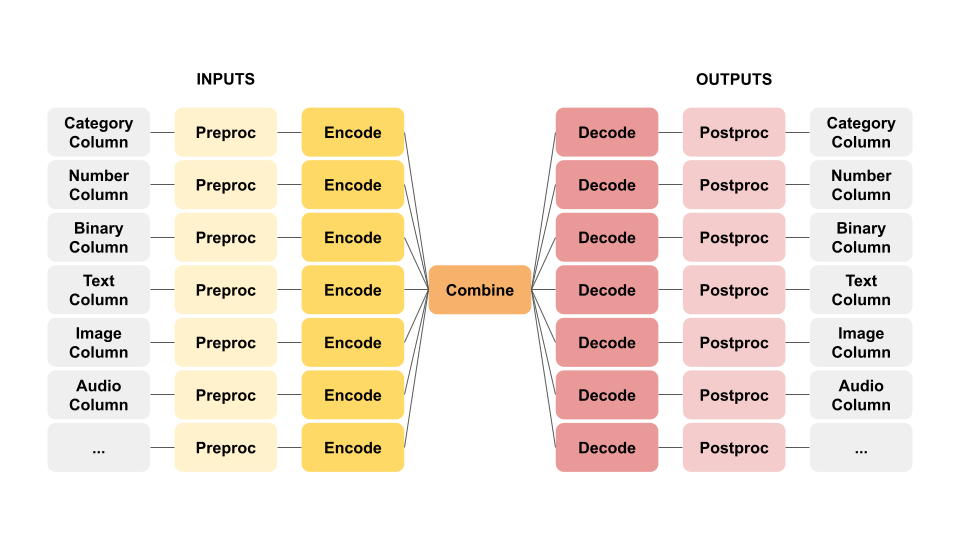

The Ludwig configuration's `output_features` section has the same structure as `input_features`, which is a list of
feature definitions, each of which contains a `name` and a `type`, with optional `preprocessing`, that users want their
model to predict.

=== "YAML"

    ```yaml
    output_features:
        -
            name: french
            type: text
    ```

=== "Python Dict"

    ```python
    {
        "output_features": [
            {
                "name": "french",
                "type": "text",
            }
        ]
    }
    ```

# Decoders

Recall Ludwig's butterfly framework:



Instead of having `encoders`, output features have `decoders`. All the other parameters besides `name` and `type` will
be passed as parameters to the decoder subsection which dictates how to build the output feature's decoder. Like
encoders, each decoder can also have different parameters, so we have extensive documentation for each decoder that can
be used for a certain data type. This can be found in [each data type's documentation](../features/supported_data_types.md).

=== "YAML"

    ```yaml
    output_features:
        -
            name: french
            type: text
            decoder: 
                type: generator
                cell_type: lstm
                num_layers: 2
                max_sequence_length: 256
    ```

=== "Python Dict"

    ```python
    {
        "output_features": [
            {
                "name": "french",
                "type": "text",
                "decoder": {
                    "type": "generator",
                    "cell_type": "lstm",
                    "num_layers": 2,
                    "max_sequence_length": 256
                }
            }
        ]
    }
    ```

Decoders take the output of the combiner as input, process it further, for instance passing it through fully connected
layers, and predict values, which are subsequently used to compute loss and evaluation metrics.

Decoders have additional parameters, in particular `loss` that allows you to specify a different loss to optimize for
this specific decoder. For instance, number features support both `mean_squared_error` and `mean_absolute_error` as
losses.

Details about the available decoders and losses alongside with the description of all parameters is provided in
datatype-specific documentation.

It's also possible to specify decoder type and decoder related parameters for all features of a
certain type. See [Type-Global Decoder](../defaults.md#type-global-decoder).

# Multi-task Learning

In most machine learning tasks you want to predict only one target variable, but in Ludwig users are empowered to
specify multiple output features. During training, output features are optimized in a multi-task fashion, using a
weighted sum of their losses as a combined loss. Ludwig natively supports multi-task learning.

When multiple output features are specified, the loss that is optimized is a weighted sum of the losses of each
individual output feature.

By default each loss weight is `1`, but this can be changed by specifying a value for the `weight` parameter in the
`loss` section of each output feature definition.

For example, given a `category` feature `A` and `number` feature `B`, in order to optimize the loss
`loss_total = 1.5 * loss_A + 0.8 + loss_B` the `output_feature` section of the configuration should look like:

=== "YAML"

    ```yaml
    output_features:
        -
            name: A
            type: category
            loss:
                weight: 1.5
        -
            name: A
            type: number
            loss:
                weight: 0.8
    ```

=== "Python Dict"

    ```python
    {
        "output_features": [
            {
                "name": "A",
                "type": "category",
                "loss": {
                    "weight": 1.5
                }
            },
            {
                "name": "A",
                "type": "number",
                "loss": {
                    "weight": 0.8
                }
            }
        ]
    }
    ```

# Output Feature Dependencies

An additional feature that Ludwig provides is the concept of dependencies between `output_features`.

Sometimes output features have strong causal relationships, and knowing which prediction has been made for one can
improve the prediction for the other. For example, if there are two output features: 1) coarse grained category and 2)
fine-grained category, knowing the prediction made for coarse grained can productively clarify the possible choices for
the fine-grained category.

Output feature dependencies are declared in the feature definition. For example:

=== "YAML"

    ```yaml
    output_features:
        -
            name: coarse_class
            type: category
            decoder:
                num_fc_layers: 2
                output_size: 64
        -
            name: fine_class
            type: category
            dependencies:
                - coarse_class
            decoder:
                num_fc_layers: 1
                output_size: 64
    ```

=== "Python Dict"

    ```
    {
        "output_features": [
            {
                "name": "coarse_class",
                "type": "category",
                "decoder": {
                    "num_fc_layers": 2,
                    "output_size": 64
                }
            },
            {
                "name": "fine_class",
                "type": "category",
                "dependencies": [
                    "coarse_class"
                ],
                "decoder": {
                    "num_fc_layers": 1,
                    "output_size": 64
                }
            }
        ]
    }
    ```

At model building time Ludwig checks that no cyclic dependency exists.

For the downstream feature, Ludwig will concatenate all the final representations before the prediction of any dependent
output features to feed as input to the downstream feature's decoder[^1]

[^1]:
    Assuming the input coming from the combiner has hidden dimension `h` 128, there are two fully connected layers that
    return a vector with hidden size 64 at the end of the `coarse_class` decoder (that vector will be used for the final
    layer before projecting in the output `coarse_class` space). In the decoder of `fine_class`, the 64 dimensional
    vector of `coarse_class` will be concatenated with the combiner output vector, making a vector of hidden size 192
    that will be passed through a fully connected layer and the 64 dimensional output will be used for the final layer
    before projecting in the output class space of the `fine_class`.
