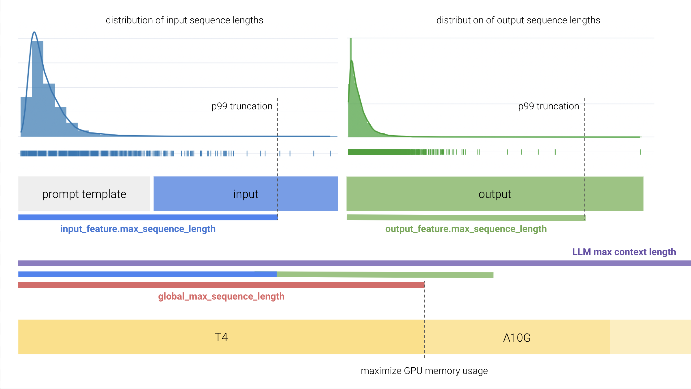



Large Language Models (LLMs) are a kind of neural network used for text generation
tasks like chatbots, coding assistants, etc. Unlike ECD models, which are primarily
designed for _predictive_ tasks, LLMs are a fundamentally _generative_ model type.

The _backbone_ of an LLM (without the language model head used for next token
generation) can be used as a **text encoder** in ECD models when using the
[auto_transformer](./features/text_features.md#huggingface-encoders) encoder. If you wish
to use LLMs for predictive tasks like classification and regression, try ECD. For generative
tasks, read on!

Example config for fine-tuning [LLaMA-2-7b](https://huggingface.co/meta-llama/Llama-2-7b-hf):

```yaml
model_type: llm
base_model: meta-llama/Llama-2-7b-hf
input_features:
  - name: input
    type: text
output_features:
  - name: response
    type: text
prompt:
  template: |
    [INST] <<SYS>>
    You are a helpful, detailed, and polite artificial 
    intelligence assistant. Your answers are clear and 
    suitable for a professional environment.
    If context is provided, answer using only the provided 
    contextual information.
    <</SYS>>
    {user_message_1} [/INST]
adapter:
  type: lora
quantization:
  bits: 4
trainer:
  type: finetune
  learning_rate: 0.0001
  batch_size: 1
  gradient_accumulation_steps: 8
  epochs: 3
```

# Base Model

The `base_model` parameter specifies the pretrained large language model to serve
as the foundation of your custom LLM.

Currently, any pretrained HuggingFace Causal LM model from the [HuggingFace Hub](https://huggingface.co/models?pipeline_tag=text-generation&sort=downloads) is supported as a `base_model`.

Example:

```yaml
base_model: meta-llama/Llama-2-7b-hf
```

!!! attention

    Some models on the HuggingFace Hub require executing untrusted code. For security reasons,
    these models are currently unsupported. If you have interest in using one of these models,
    please file a GitHub issue with your use case.

You can also pass in a path to a locally saved Hugging Face model instead of loading from Hugging Face directly.

Example:

```yaml
base_model: path/to/local/model/weights
```

## HuggingFace Access Token

Some base models like Llama-2 require authorization from HuggingFace to download,
which in turn requires obtaining a HuggingFace [User Access Token](https://huggingface.co/docs/hub/security-tokens).

Once you have obtained permission to download your preferred base model and have a user access token,
you only need to ensure that your token is exposes as an environment variable in order for Ludwig to be
able to use it:

```bash
export HUGGING_FACE_HUB_TOKEN="<api_token>"
ludwig train ...
```

# Features

## Input Features

Currently, the LLM model type only supports a single input feature of type `text`.

If no `prompt` template is provided, this feature must correspond to a column
in the input dataset. If a prompt template is provided, the rendered prompt
will be used as the input feature value during training and inference.

```yaml
input_features:
  - name: input
    type: text
```

See [Text Features](./features/text_features.md) for
configuration options.

## Output Features

Currently, the LLM model type only supports a single output feature.

### LLM Text Output Feature

When fine-tuning (`trainer.type: finetune`), the output feature type must be
`text`. Even if you are fine-tuning your LLM for a binary or multi-class classification
problem, set the output feature type of that column to `text`.

For in-context learning or zero shot learning (`trainer.type: none`), the output
feature type can be one of `text` or `category`.

```yaml
output_features:
  - name: response
    type: text
```

See [Text Output Features](./features/text_features.md#output-features) for
configuration options.

### LLM Category Output Feature

In order to use the `category` output feature type, you must provide two additional specifications. The first additional specification is a set of `match` values as part of the decoder configuration. These match values are used to determine which category label to assign to the generated response. This is particularly helpful to mitigate against cases where LLM text generation deviates from the desired response format.

The second additional specification is a fallback label in `preprocessing.fallback_label`. This label is used both for filling in missing values in the output feature column in your dataset, but also for providing a pre-determined value when the LLM is unable to generate a response that matches any of the categories provided.

```yaml
output_features:
  - name: label
    type: category
    preprocessing:
      fallback_label: "neutral"
    decoder:
      type: category_extractor
      match:
        "negative":
          type: contains
          value: "positive"
        "neutral":
          type: contains
          value: "neutral"
        "positive":
          type: contains
          value: "positive"
```

# Prompt

One of the unique properties of large language models as compared to more conventional deep learning models is their ability to incorporate context inserted into the “prompt” to generate more specific and accurate responses.

The `prompt` parameter can be used to:

- Provide necessary boilerplate needed to make the LLM respond in the correct way (for example, with a response to a question rather than a continuation of the input sequence).
- Combine multiple columns from a dataset into a single text input feature (see [TabLLM](https://arxiv.org/abs/2210.10723)).
- Provide additional context to the model that can help it understand the task, or provide restrictions to prevent hallucinations.

To make use of prompting, one of `prompt.template` or `prompt.task` must be provided. Otherwise the input feature value is passed into
the LLM as-is. Use `template` for fine-grained control over every aspect of the prompt, and use `task` to specify the nature of the
task the LLM is to perform while delegating the exact prompt template to Ludwig's defaults.

!!! attention

    Some models that have already been instruction tuned will have been trained
    to expect a specific prompt template structure. Unfortunately, this isn't
    provided in any model metadata, and as such, you may need to dig around or
    experiment with different prompt templates to find what works best when
    performing [in-context learning](#in-context-learning).


{{ render_yaml(prompt, parent="prompt") }}

{{ render_fields(schema_class_to_fields(prompt)) }}

## Retrieval


{{ render_yaml(retrieval, parent="retrieval") }}

{{ render_fields(schema_class_to_fields(retrieval)) }}

# Max Sequence Lengths

There are [many factors at play](https://www.youtube.com/watch?v=g68qlo9Izf0&t=2685s)
when it comes to fine-tuning LLMs efficiently on a single GPU.

One of the most important parameters in your control to keep GPU memory usage in
check is the choice of the maximum sequence length.

Ludwig provides 3 primary knobs to control max sequence lengths:

1. `input_feature.preprocessing.max_sequence_length` on the input example, which includes your prompt.
2. `output_feature.preprocessing.max_sequence_length` on the output example, which does not include your prompt.
3. `preprocessing.global_max_sequence_length`, which is the maximum length sequence (merged input and output) fed to the LLM's forward pass during training.



If you are running into GPU OOM issues, consider profiling your dataset to
understand the distribution of sequence lengths. For input/output columns with a
long tail distribution, it may be worth considering choosing a smaller max
sequence length as to truncate a small portion of your data while still training
with smaller GPUs.

# Adapter

One of the biggest barriers to cost effective fine-tuning for LLMs is the need to update billions of parameters each training step. Parameter efficient fine-tuning (PEFT) adatpers are a collection of techniques that reduce the number of trainable parameters during fine-tuning to speed up training, and decrease the memory and disk space required to train large language models.

[PEFT](https://github.com/huggingface/peft) is a popular library from HuggingFace that implements a number of popular parameter efficient fine-tuning strategies. Ludwig provides native integration with PEFT, allowing you to leverage any number of techniques to more efficiently fine-tune LLMs through
the `adapter` config parameter.




### {{ adapter.name() }}

{{ adapter.description() }}

{{ render_yaml(adapter, parent="adapter") }}

{{ render_fields(schema_class_to_fields(adapter, exclude=["type"])) }}


# Quantization

Quantization allows you to load model parameters, which are typically stored
as 16 or 32 bit floating-points, as 4 bit or 8 bit integers. This allows
you to reduce the GPU memory overhead by a factor of up to 8x.

When combined with the LoRA [adapter](#adapter), you can perform quantized
fine-tuning as described in the paper [QLoRA](https://arxiv.org/abs/2305.14314). For
context, this enables training large language models as big as 7 billion parameters
on a single commodity GPU with minimal performance penalties.

!!! attention

    Quantized fine-tuning currently requires using `adapter: lora`. In-context
    learning does not have this restriction.

!!! attention

    Quantization is currently only supported with `backend: local`.


{{ render_yaml(quantization, parent="quantization") }}

{{ render_fields(schema_class_to_fields(quantization)) }}

# Model Parameters

The model parameters section is used to customized LLM model parameters during model initialization.
Currently, the only supported initialization parameter is `rope_scaling`.

```yaml
# Defaults
model_parameters:
  rope_scaling: {}
  neftune_noise_alpha: 0
```

## RoPE Scaling

Large language models like LLaMA-2 face a limitation in the length of context they can consider, which impacts their
capacity to comprehend intricate queries or chat-style discussions spanning multiple paragraphs. For instance,
LlaMA-2's context is capped at 4096 tokens, or roughly 3000 English words. This renders the model ineffective for
tasks involving lengthy documents that surpass this context length.

**RoPE Scaling** presents a way to increase the context length of your model at the cost of a slight performance
penalty using a method called Position Interpolation. You can read more about it in the original paper
[here](https://arxiv.org/pdf/2306.15595.pdf).

There are two parameters to consider for RoPE scaling: `type` and `factor`. The typical rule of thumb is that
your new context length will be `context_length` \* `factor`. So, if you want to extend LLaMA-2 to have a context
length of ~ 16K tokens, you would set the `factor` to 4.0. The `type` attribute supports `linear` interpolation
and `dynamic` interpolation. Typically, `dynamic` interpolation has the best performance over larger context lengths
while maintaining low perplexity.


_Credit to /u/emozilla and /u/kaiokendev on Reddit for their work and this graphic._

You can enable RoPE Scaling in Ludwig using the following config:


{{ render_yaml(rs, parent="rope_scaling", updates={"type": "dynamic", "factor": 2.0}) }}

{{ render_fields(schema_class_to_fields(rs)) }}

!!! attention

    Typically, you need to fine-tune your LLM for about 1000 steps with RoPE scaling enabled
    to ensure that the performance drop with RoPE scaling is minimal and the model adapts your data
    to the new RoPE embeddings.

## Neftune Noise Alpha

NEFTune is a technique to boost the performance of models during fine-tuning. NEFTune adds noise to the embedding
vectors during training. The alpha parameter serves as a control mechanism, allowing users to regulate the intensity of noise introduced to embeddings. A higher alpha value corresponds to a greater amount of noise, impacting the embedding vectors during
the fine-tuning phase.

Standard finetuning of LLaMA-2-7B using Alpaca achieves 29.79% on AlpacaEval, which rises to
64.69% using noisy embeddings. NEFTune also improves over strong baselines on modern instruction datasets. You can find more information [in the paper](available at https://arxiv.org/pdf/2310.05914.pdf) titled "NEFTune: Noisy Embeddings Improve Instruction Finetuning".


You can enable NEFTune in Ludwig using the following config:

```yaml
model_parameters:
  neftune_noise_alpha: 5
```

# Trainer

LLMs support multiple different training objectives:

- **Fine-Tuning** (`type: finetune`): update the weights of a pretrained LLM with supervised learning.
- **In-Context Learning** (`type: none`): evaluate model performance and predict using only context provided in the prompt.

## Fine-Tuning

For fine-tuning, see the [Trainer](./trainer.md) section for configuration
options.

```yaml
trainer:
  type: finetune
```

## In-Context Learning

For in-context learning, the `none` trainer is specified to denote that no
model parameters will be updated and the "training" step will essentially be
a no-op, except for the purpose of computing metrics on the test set.

```yaml
trainer:
  type: none
```

# Generation

When generating text during inference using a pretrained or fine-tuned LLM, you may
often want to control the generation process, such as what token decoding strategy to use,
how many new tokens to produce, which tokens to exclude, or how diverse you want the generated
text to be. All of these can be controlled through the `generation` config in Ludwig.

While Ludwig sets predefined default values for most of these parameters, some of the most useful parameters
to control the generation process are:

- `max_new_tokens`
- `temperature`
- `do_sample`
- `num_beams`
- `top_k`
- `top_p`

Check out the description for these parameters below!


{{ render_yaml(gen, parent="generation") }}

{{ render_fields(schema_class_to_fields(gen)) }}

## Generation Strategies

Text generation can be performed in a variety of ways for inference. Broadly, there are 5 strategies:

- **Greedy Decoding (default)**: Greedy search is the simplest decoding method. It selects the word with the highest probability as its next word at each time step `t`.
- **Beam Search**: Beam search reduces the risk of missing hidden high probability word sequences by keeping the most likely `num_beams` of hypotheses at each time step `t` and eventually choosing the hypothesis that has the overall highest probability.
- **Sampling**: Sampling means randomly picking the next word according to its conditional probability distribution. Language generation using sampling is not deterministic.
- **Top-k Sampling**: In Top-k sampling, the `k` most likely next words are filtered and the probability mass is redistributed among only those `k` next words.
- **Top-p (nucleus) sampling**: Instead of sampling only from the most likely K words, Top-p sampling chooses from the smallest possible set of words whose cumulative probability exceeds the probability `p`. The probability mass is then redistributed among this set of words. This way, the size of the set of words (a.k.a the number of words in the set) can dynamically increase and decrease according to the next word's probability distribution.

If you want to enable a decoding strategy other than **greedy decoding**, you can set the following parameters in the generation config to enable them.

- **Greedy Decoding (default)**:

  ```yaml
  generation:
    num_beams: 1
    do_sample: false
  ```

- **Multinomial Sampling**:

  ```yaml
  generation:
    num_beams: 1
    do_sample: true
  ```

- **Beam-Search Decoding**:

  ```yaml
  generation:
    num_beams: 2 # Must be > 1
    do_sample: false
  ```

- **Contrastive Search**:

  ```yaml
  generation:
    penalty_alpha: 0.1 # Must be > 0
    top_k: 2 # Must be > 1
  ```

- **Beam-Search Multinomial Sampling**:

  ```yaml
  generation:
    num_beams: 2 # Must be > 1
    do_sample: true
  ```

- **Diverse Beam-Search Decoding**:

  ```yaml
  generation:
    num_beams: 2 # Must be > 1
    num_beam_groups: 2 # Must be > 1
  ```

To read more about how these decoding strategies work in a visual manner, check out [this](https://huggingface.co/blog/how-to-generate) excellent blogpost by HuggingFace.

# Post Fine-Tuning

## Uploading Fine-Tuned LLM weights to HuggingFace Hub

Once you've fine-tuned your model, you can upload your fine-tuned model artifacts straight
to HuggingFace Hub, either in a public model repository that anyone can access, or to a private
repository. This works for both artifacts produced during full fine-tuning, as well as adapter
based fine-tuning. From there, you can pull the weights straight into a downstream inference service,
or even use it directly through Ludwig for inference.

```sh
ludwig upload hf_hub --repo_id <repo_id> --model_path </path/to/saved/model>
```

To learn more on how to do this, click [here](../user_guide/api/LudwigModel.md#upload_to_hf_hub).
