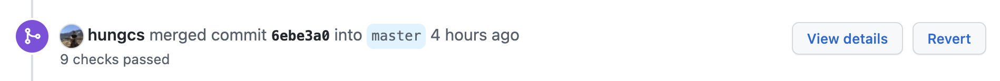

# Standard release process

## 1. Determine the version name

!!! note

    Version names always begin with `v`.

Examples of version names:

```python
"vX.Y"      # Release major version X (starts at 0), minor version Y (starts at 1).
"vX.Y.Z"    # Release major version X (starts at 0), minor version Y (starts at 1), patch Z (starts at 1).
"vX.YrcZ"   # Release candidate Z, without a period. (starts at 1)
"vX.Y.dev"  # Developer version, with a period.
```

Inspiration:

- [Python pre-releases](https://packaging.python.org/en/latest/guides/distributing-packages-using-setuptools/#pre-release-versioning).
- [PEP0440 pre-releases](https://www.python.org/dev/peps/pep-0440/#pre-releases).

## 2. Update Ludwig versions in code

Create a new branch off of a target_release_branch, e.g. `master` or `X.Y-stable`.

```bash
git checkout <TARGET_RELEASE_BRANCH>
git checkout -b ludwig_release
git push --set-upstream origin ludwig_release
```

Update the versions referenced in globals and setup. [Reference PR](https://github.com/ludwig-ai/ludwig/pull/1723/files).

```
git commit -m "Update ludwig version to vX.YrcZ."
git push
```

Create a PR with the change requesting a merge from `ludwig_release` to the target branch.

Get approval from a [Ludwig maintainer](https://github.com/orgs/ludwig-ai/teams/ludwig-maintainers).

Merge PR (with squashing).

## 3. Tag the latest commit, and push the tag

After merging the PR from step 2, the latest commit on the target_release_branch
should be the PR that upgrades ludwig versions in code.

Pull the change from head.

```bash
git checkout <TARGET_RELEASE_BRANCH>
git pull
```

Add a tag to the commit locally:

```bash
git tag -a vX.YrcZ -m "Ludwig vX.YrcZ"
```

Push tags to the repo.

```
git push --follow-tags
```

## 4. In Github, go to releases and "Draft a new release"

Loom [walk-through](https://www.loom.com/share/78eb7f9134404a80bde9359cfa7af2b7).

Release candidates don't need release notes. Full releases should have detailed
release notes. All releases should include a full list of changes (Github
supports generating this automatically).

Do not upload assets manually. These will be created automatically by Github.

For release candidates, check "pre-release".

## 5. Click publish

When the release notes are ready, click `Publish release` on Github. Ludwig's
CI will automatically update PyPI.

## 6. Update Ludwig docs

Check that the [Ludwig PyPi](https://pypi.org/project/ludwig/) has been updated
with the newest version.

Go to the ludwig-docs repo and update the auto-generated docs there.

```
> cd ludwig-docs
> git pull
> git checkout -b update_docs
> pip install ludwig --upgrade
> python code_doc_autogen.py
```

If there are any changes, commit them.

```
> git commit -m "Update auto-generated docs."
> git push --set-upstream origin update_docs
```

Create a PR.

## 7. For major releases, create an X.Y-stable branch

```bash
> git checkout master
> git checkout -b X.Y-stable
> git push --set-upstream origin X.Y-stable
```

All subsequent minor releases on top of this major version will be based from
this branch.

## 8. Spread the word

Announce the release on Slack.

    Ludwig X.Y.Z Released
    Features: Improvements to <CONTENT>. See <LINK>release notes<LINK> for complete details.
    Docs: https://ludwig-ai.github.io/ludwig-docs/latest/

If it's a major version release, consider other forms of publicization like
coordinating sharing the release on other social media, or writing a blog post.

# Cherrypicking bugfix commits from master to stable release branches

## 1. Gather a list of commit hashes that should be cherrypicked

You can use either the full hashes from `git log` or partial hashes from the
Github PR UI, i.e.



## 2. Cherry pick each commit in a X.Y-cherrypick branch

```bash
git checkout X.Y-stable
git checkout -b X.Y-cherrypick
git cherry-pick <commit_1>  # One commit at a time.
git cherry-pick <commit_2> <commit_3> <commit_4> ...  # Or multiple commits all at once.
```

Ensure that all cherry-picks have been correctly applied.

!!! note

    Empty cherry-picks could mean that that commit already exists.

## 3. Create a PR with the cherry-pick changes, merging into `X.Y-stable`

Push the cherrypick branch.

```
git push --set-upstream origin X.Y-cherrypick
```

Create a PR with the change requesting a merge from `X.Y-cherrypick` to `X.Y-stable`.

Get approval from a [Ludwig maintainer](https://github.com/orgs/ludwig-ai/teams/ludwig-maintainers).

Merge PR **without** squashing.

Continue with the [standard release process](#standard-release-process).

# Appendix

## Oops, more PRs were merged after the version bump

If there were some last minute PRs merged after the version bump, reorder the commits to make the version bump be the last commit that gets tagged before the release.

[Reordering Commits in Git](https://www.youtube.com/watch?v=V9KpcGO7nLo)

## Oops, I tagged the wrong commit, and pushed it to github already

```bash
git tag -d <tagname>                  # delete the old tag locally
git push origin :refs/tags/<tagname>  # delete the old tag remotely
git tag <tagname> <commitId>          # make a new tag locally
git push origin <tagname>             # push the new local tag to the remote
```
