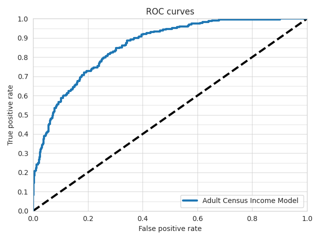
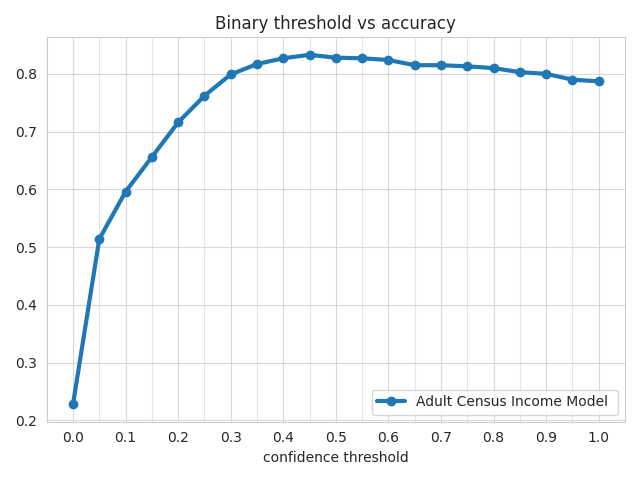
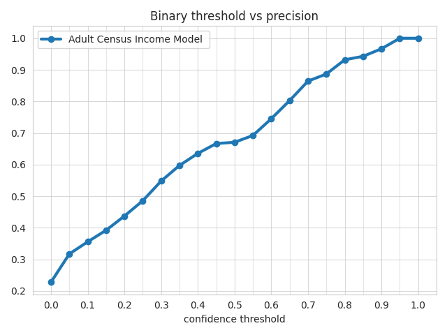
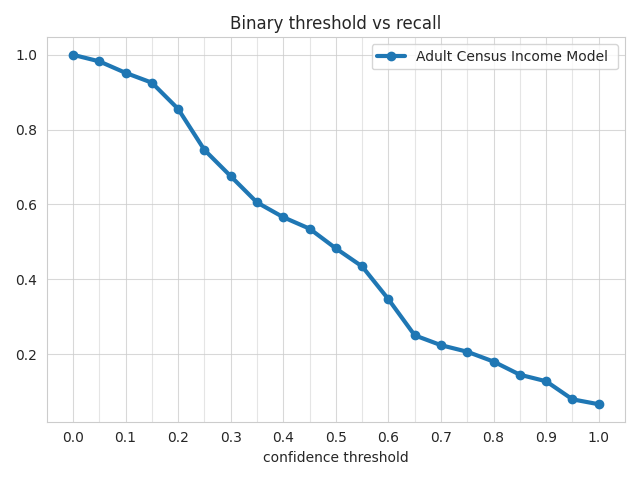
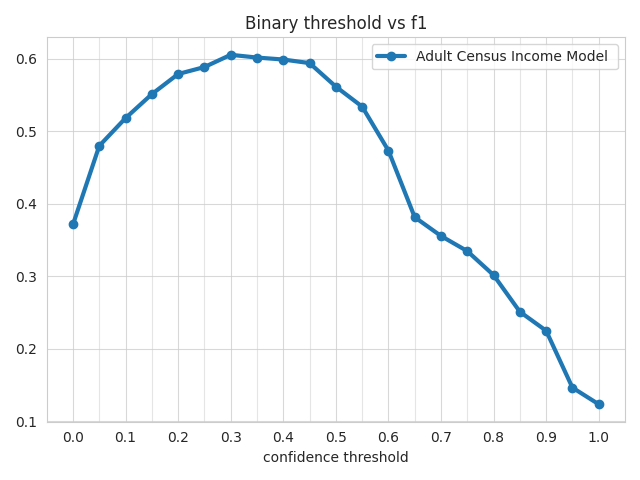
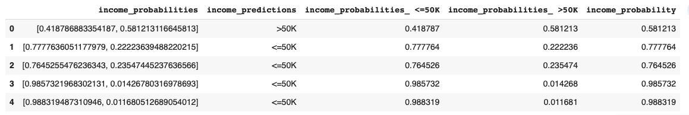

This is a complete example of training a model for binary classification.

These interactive notebooks follow the steps of this example:

**TODO: point notebook URL to ludwig-ai/ludwig-docs repo before PR merge**

- Ludwig CLI: [](https://colab.research.google.com/github/jimthompson5802/ludwig-docs/blob/expanded-tabular-data-example/docs/examples/adult_census_income_colab_notebooks/Adult_Census_Income_Classification_with_Ludwig_CLI.ipynb)
- Ludwig Python API: [](https://colab.research.google.com/github/jimthompson5802/ludwig-docs/blob/expanded-tabular-data-example/docs/examples/adult_census_income_colab_notebooks/Adult_Income_Census_Classification_with_Ludwig_API.ipynb)

## Download the Adult Census Income dataset

[Adult Census Income](https://archive.ics.uci.edu/ml/datasets/adult) is an extract of 1994 Census data for predicting whether a person's income exceeds $50K per year.  The data set consists of over 49K records with 14 attributes with missing data.

```shell
ludwig datasets download adult_census_income
```

This command will create a dataset `adult_census_income.csv` in the current directory.

The columns in the dataset are

| column         | description                                                  |
|----------------|--------------------------------------------------------------|
| age            | numeric variable, age of person                              |
| workclass      | categorical variable, Type of empolyment                     |
| fnlwgt         | numeric variable, no defintion                               |
| education      | categorical variable, education level                        |
| education-num  | nmeric variable, no definition                               |
| marital-status | categorical variable, marital status                         |
| occupation     | categorical variable, occupation                             |
| relationship   | categorical variable, Relationship to household              |
| race           | categorical variable, race                                   |
| sex            | categorical variable, gender                                 |
| capital-gain   | numeric variable, no definition                              |
| capital-loss   | numeric variable, no definition                              |
| hours-per-week | numeric variable, hours worked per week                      |
| native-country | categorical variable, Country of origin                      |
| income         | binary variable, " <=50K" or " >50K"                         |
| split          | numeric variable, indicating data split training(0), test(2) |

## Train

The Ludwig configuration file describes the machine learning task.  There is a vast array of options to control the learning process.  This example only covers a small fraction of the options.  Only the options used in this example are described.  Please refer to the [Configuration Section](../../configuration) for all the details.

First ['preprocessing' section](../../configuration/preprocessing) defines the gloabl preprocessing options.  All [numeric features](../../configuration/features/number_features) are z-scored normalized, i.e., mean centered and scaled by the standard deviation.  Numeric missing values are filled in with the mean of non-missing values.

The `input_features` section describes each of the predictor variables, i.e., the column name and type of input variable: [number](../../configuration/features/number_features) or [category](../../configuration/features/category_features/)

The 'combiner' section defines how the input features are combined to be passed to the output decoder.  This example uses the [`concat` combiner](configuration/combiner/#concat-combiner), which simply concatenates the output of the input feature encoders.  The combined data is passed through a three layer fully connected network of 128 cells in each layer with dropout regularization.

Next the `output_features` are defined.  In this example, there is one response variable called `income`.  This is a [binary feature](../../configuration/features/binary_features/) with two possible values: " <=50K" or " >50K".  Because thes values are not conventional binary values, i.e., "True" and "False", a feature specific preprocessing option is specified to indicate which string (" >50K") is interpreted as "True".  A four layer fully connected decoder of 32 cells in each layer is specified for this output feature.

The last section in this configuration file describes options for how the the [`trainer`](../../configuration/trainer/) will operate.  In this example the `trainer` will process the training data for 10 epochs.  The optimizer type is "adam".

With `config.yaml`:

```yaml
preprocessing:
  number:
    normalization: zscore
    missing_value_strategy: fill_with_mean

input_features:
  - name: age
    type: number
  - name: workclass
    type: category
  - name: fnlwgt
    type: number
  - name: education
    type: category
  - name: education-num
    type: number
  - name: marital-status
    type: category
  - name: occupation
    type: category
  - name: relationship
    type: category
  - name: race
    type: category
  - name: sex
    type: category
  - name: capital-gain
    type: number
  - name: capital-loss
    type: number
  - name: hours-per-week
    type: number
  - name: native-country
    type: category

combiner:
  type: concat
  num_fc_layers: 3
  output_size: 128
  dropout: 0.2

output_features:
  - name: income
    type: binary
    preprocessing:
      fallback_true_label: " >50K"
    num_fc_layers: 4
    output_size: 32

trainer:
  epochs:10
  optimizer:
    type: adam
```

```shell
ludwig train \
  --dataset adult_census_income.csv \
  --config config.yaml
```

## Evaluate

```shell
ludwig evaluate --model_path results/experiment_run/model \
                 --dataset evaluation_dataset.csv \
                 --output_directory test_results
```

## Visualize Metrics

### ROC Curve

```shell
!ludwig visualize --visualization roc_curves \
                  --ground_truth evaluation_dataset.csv \
                  --ground_truth_metadata results/experiment_run/model/training_set_metadata.json \
                  --probabilities test_results/predictions.parquet \
                  --output_feature_name income \
                  --output_directory visualizations \
                  --model_names "Adult Census Income Model" \
                  --file_format png
```



### Binary Threshold Metrics

```shell
ludwig visualize --visualization binary_threshold_vs_metric \
                  --ground_truth evaluation_dataset.csv \
                  --ground_truth_metadata results/experiment_run/model/training_set_metadata.json \
                  --probabilities test_results/predictions.parquet \
                  --output_feature_name income \
                  --positive_label 1 \
                  --output_directory visualizations \
                  --model_names "Adult Census Income Model" \
                  --metrics accuracy precision recall f1\
                  --file_format png
```

#### Accuracy Metric



#### Precision Metric



#### Recall Metric



#### F1 Metric



## Predictions

Make predictions.

```shell
ludwig predict --model_path results/experiment_run/model \
                --dataset evaluation_dataset.csv \
                --output_directory predictions
```

Sample predictions

