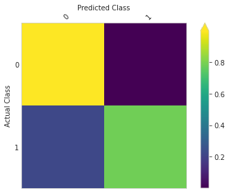
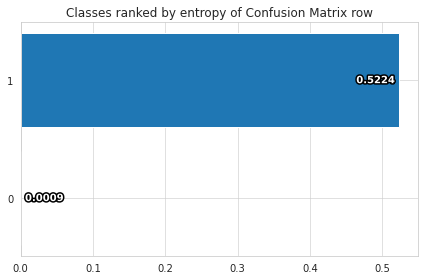

Welcome to this tutorial on training a GBM model for detecting credit card fraud using the creditcard_fraud Ludwig dataset!

Open this example in an interactive notebook:
[](https://colab.research.google.com/github/ludwig-ai/ludwig-docs/blob/master/docs/examples/gbm/Fraud_Detection_with_GBM.ipynb)

## Load data

First, let's download the dataset from Kaggle.

```shell
!ludwig datasets download creditcard_fraud
```

This command will download the [credit card fraud dataset from Kaggle](https://www.kaggle.com/datasets/mlg-ulb/creditcardfraud).

The creditcard_fraud dataset contains over 284K records with 31 features and a binary label indicating whether a transaction was fraudulent or not.

```python
from ludwig.benchmarking.utils import load_from_module
from ludwig.datasets import creditcard_fraud

df = load_from_module(creditcard_fraud, {'name': 'Class', 'type': 'binary'})
```

This will load the dataset into a Pandas DataFrame and add a reproducible train/valid/test split, stratified on the output feature.

```python
df.groupby('split').Class.value_counts()
```

|split|Class|count|
|-----|-----|-----|
|0|0|178180|
| |1|349|
|1|0|19802|
| |1|34|
|2|0|86333|
| |1|109|

## Training

Next, let's create a Ludwig configuration to define our machine learning task. In this configuration, we will specify that we want to use a GBM model for training. We will also specify the input and output features and set some hyperparameters for the model. For more details about the available trainer parameters, see the [user guide](https://ludwig.ai/latest/configuration/trainer/).

```python
import yaml

config = yaml.safe_load(
"""
model_type: gbm

input_features:
  - name: Time
    type: number
  - name: V1
    type: number
  - name: V2
    type: number
  - name: V3
    type: number
  - name: V4
    type: number
  - name: V5
    type: number
  - name: V6
    type: number
  - name: V7
    type: number
  - name: V8
    type: number
  - name: V9
    type: number
  - name: V10
    type: number
  - name: V11
    type: number
  - name: V12
    type: number
  - name: V13
    type: number
  - name: V14
    type: number
  - name: V15
    type: number
  - name: V16
    type: number
  - name: V17
    type: number
  - name: V18
    type: number
  - name: V19
    type: number
  - name: V20
    type: number
  - name: V21
    type: number
  - name: V22
    type: number
  - name: V23
    type: number
  - name: V24
    type: number
  - name: V25
    type: number
  - name: V26
    type: number
  - name: V27
    type: number
  - name: V28
    type: number
  - name: Amount
    type: number

output_features:
  - name: Class
    type: binary

trainer:
  num_boost_round: 300
  lambda_l1: 0.00011379587942715957
  lambda_l2: 8.286477350867434
  bagging_fraction: 0.4868130193152093
  feature_fraction: 0.462444410839139
  evaluate_training_set: false
"""
)
```

Now that we have our data and configuration set up, we can train our GBM model using the following command:

```python
import logging
from ludwig.api import LudwigModel

model = LudwigModel(config, logging_level=logging.INFO)
train_stats, preprocessed_data, output_directory = model.train(df)
```

## Evaluation

Once the training is complete, we can evaluate the performance of our model using the `model.evaluate` command:

```python
train, valid, test, metadata = preprocessed_data

evaluation_statistics, predictions, output_directory = model.evaluate(test, collect_overall_stats=True)
```

**ROC AUC**

```python
evaluation_statistics['Class']["roc_auc"]
```

0.9429567456245422

**Accuracy**

```python
evaluation_statistics['Class']["accuracy"]
```

0.9995435476303101

**Precision, recall and F1**

```python
evaluation_statistics['Class']["overall_stats"]
```

```python
{'token_accuracy': 0.9995435633656935,
 'avg_precision_macro': 0.9689512098036177,
 'avg_recall_macro': 0.8917086143188491,
 'avg_f1_score_macro': 0.9268520044110913,
 'avg_precision_micro': 0.9995435633656935,
 'avg_recall_micro': 0.9995435633656935,
 'avg_f1_score_micro': 0.9995435633656935,
 'avg_precision_weighted': 0.9995435633656935,
 'avg_recall_weighted': 0.9995435633656935,
 'avg_f1_score_weighted': 0.9995230814612599,
 'kappa_score': 0.8537058585299842}
```

### Visualization

In addition to evaluating the performance of our model with metrics such as accuracy, precision, and recall, it can also be helpful to visualize the results of our model. Ludwig provides several options for visualizing the results of our model, including confusion matrices and ROC curves.

```python
from ludwig import visualize
```

**Confusion matrix**

We can use the `visualize.confusion_matrix` function from Ludwig to create a confusion matrix, which shows the number of true positive, true negative, false positive, and false negative predictions made by our model. To do this, we can use the following code, which will display a confusion matrix plot showing the performance of our model.

```python
visualize.confusion_matrix(
    [evaluation_statistics],
    model.training_set_metadata,
    'Class',
    top_n_classes=[2],
    model_names=[''],
    normalize=True
)
```




**ROC curve**

We can also create an ROC curve, which plots the true positive rate against the false positive rate at different classification thresholds. To do this, we can use the following code:

```python
visualize.roc_curves(
    [predictions['Class_probabilities']],
    test.to_df()['Class_mZFLky'],
    test.to_df(),
    'Class_mZFLky',
    '1',
    model_names=["Credit Card Fraud"],
    output_directory='visualization',
    file_format='png'
)
```


We hope these visualizations have been helpful in understanding the performance of our GBM model for detecting credit card fraud. For more information on the various visualization options available in Ludwig, please refer to the [documentation](https://ludwig.ai/latest/user_guide/api/visualization/).

---

Thank you for following along with our tutorial on training a GBM model on the credit card fraud dataset. We hope that you found the tutorial helpful and gained a better understanding of how to use GBM models in your own machine learning projects.

If you have any questions or feedback, please feel free to reach out to our [community](https://ludwig.ai/latest/community/)!
