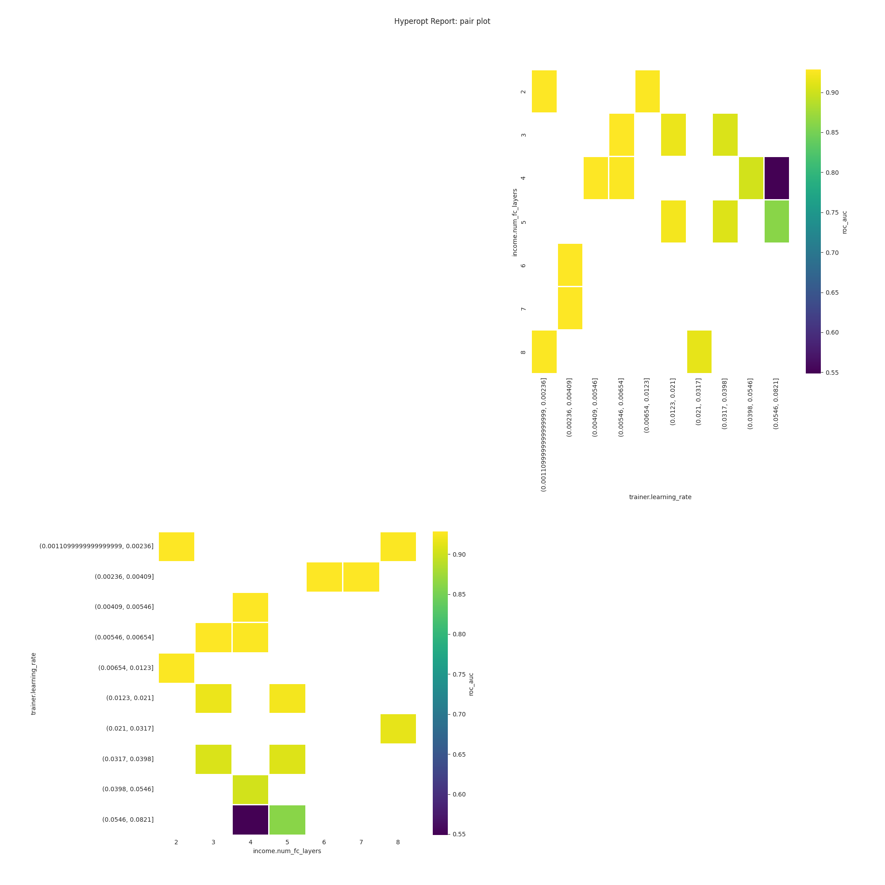
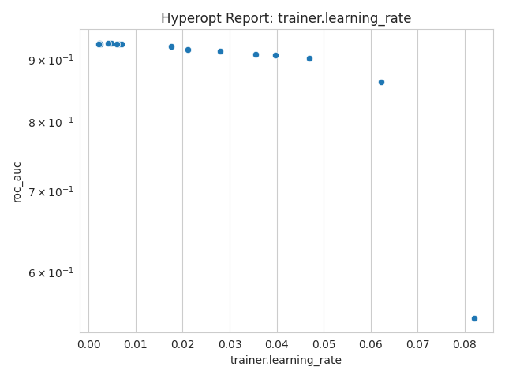
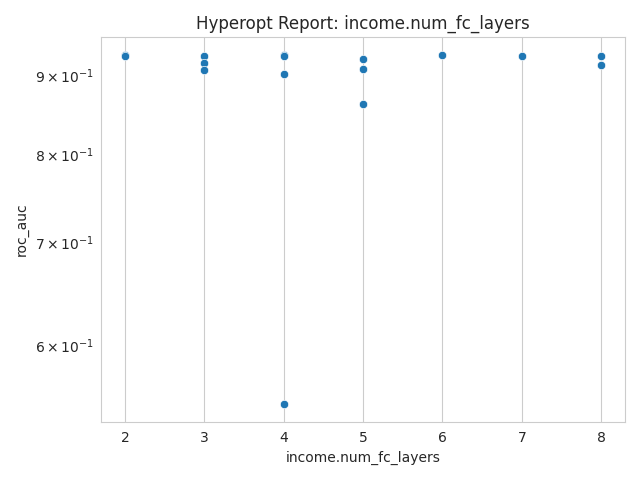
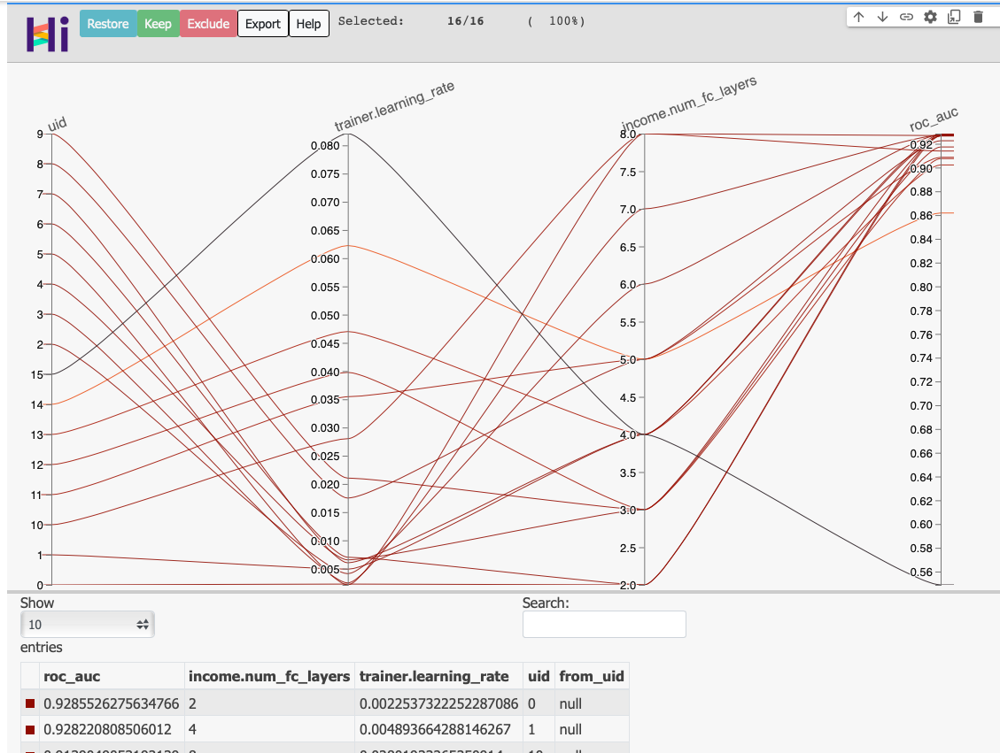

This is a complete example of Ludwig's hyperparameter optimization capability.

These interactive notebooks follow the steps of this example:

- Ludwig CLI: [](https://colab.research.google.com/github/ludwig-ai/ludwig-docs/blob/master/docs/examples/hyperopt_notebooks/hyperopt_notebook_cli.ipynb)
- Ludwig Python API: [](https://colab.research.google.com/github/ludwig-ai/ludwig-docs/blob/master/docs/examples/hyperopt_notebooks/hyperopt_notebook_api.ipynb)

## Download the Adult Census Income dataset

[Adult Census Income](https://archive.ics.uci.edu/ml/datasets/adult) is an extract of 1994 Census data for predicting whether a person's income exceeds $50K per year.  The data set consists of over 49K records with 14 attributes with missing data.

```shell
ludwig datasets download adult_census_income
```

This command will create a dataset `adult_census_income.csv` in the current directory.

The columns in the dataset are

| column         | description                                                  |
| -------------- | ------------------------------------------------------------ |
| age            | numeric variable, age of person                              |
| workclass      | categorical variable, Type of empolyment                     |
| fnlwgt         | numeric variable, no defintion                               |
| education      | categorical variable, education level                        |
| education-num  | nmeric variable, no definition                               |
| marital-status | categorical variable, marital status                         |
| occupation     | categorical variable, occupation                             |
| relationship   | categorical variable, Relationship to household              |
| race           | categorical variable, race                                   |
| sex            | categorical variable, gender                                 |
| capital-gain   | numeric variable, no definition                              |
| capital-loss   | numeric variable, no definition                              |
| hours-per-week | numeric variable, hours worked per week                      |
| native-country | categorical variable, Country of origin                      |
| income         | binary variable, " <=50K" or " >50K"                         |
| split          | numeric variable, indicating data split training(0), test(2) |

## Setup for hyperparameter optimization run

Hyperparameter optimization is defined with the [`hyperopt` section of the Ludwig configuration specification](../../configuration/hyperparameter_optimization/).  

=== "cli"

    [ludwig hyperopt](../../user_guide/)

    ```yaml
    preprocessing:
        ...
    input_features:
        ...
    combiner:
        ...
    output_features:
        ...
    trainer:
        ...

    # hyperopt specification 
    hyperopt:
        # specify parameters for the Ray Tune to executor to run the hyperparameter optimization
        executor:
            ...
        # specify Ray Tune search algorithm to use
        search_alg:
            ...
        # hyperparameter search space for the optimization
        parameters:
            ...
        # minimize or maximize the metric score
        goal: ...
        # metric score to optimize
        metric: ...
        # name of the output feature
        output_feature: ...
    ```

=== "python"

    ```python
    # define model configuration
    config = {
        'combiner': ... ,
        'input_features': ... ,
        'output_features': ... ,
        'preprocessing': ...,
        'trainer':... ,
    
        # hyperopt specification 
        'hyperopt':  {
            # specify parameters for the Ray Tune to executor to run the hyperparameter optimization
            'executor': {'type': 'ray', ... },
            # specify Ray Tune search algorithm to use
            'search_alg': {... },
            # hyperparameter search space for the optimization
            'parameters': {...},
            # minimize or maximize the metric score
            'goal': ...,
            # metric score to optimize
            'metric': ...,
            # name of the output feature
            'output_feature': ...,
        }
    }
    ```

## Hyperparameter Search Space Specification

For this example, we want to determine the effect of Ludwig's Trainer's `learning_rate` and `num_fc_layers` of the `income` output feature on model's `roc_auc` metric.  To do this we will use two different hyperparameter optimization approaches: Random Search and Grid Search.

### Random Search

=== "cli"

    ```yaml
    hyperopt:
        executor:
            num_samples: 16
        goal: maximize
        metric: roc_auc
        output_feature: income
        parameters: 
            income.num_fc_layers: 
                space: randint
                lower: 2
                upper: 9
            trainer.learning_rate:
                space: loguniform
                lower: 0.001
                upper: 0.1
        search_alg:
            type: variant_generator
            random_state: 1919
    ```

=== "python"

    ```python
     'hyperopt': {
        'executor': {'num_samples': 16, },
        'goal': 'maximize',
        'metric': 'roc_auc',
        'output_feature': 'income',
        'parameters': {
            'income.num_fc_layers': {
                'space': 'randint',
                'lower': 2,
                'upper': 9
            },
            'trainer.learning_rate': {
                'space': 'loguniform',
                'lower': 0.001,
                'upper': 0.1}
            },
        'search_alg': {'type': 'variant_generator', 'random_state': 1919, }
    },
    ```

### Grid Search

=== "cli"

    ```yaml
    hyperopt:
        executor:
            num_samples: 1
        goal: maximize
        metric: roc_auc
        output_feature: income
        parameters: 
            income.num_fc_layers: 
                space: grid_search
                values: [2, 4, 6, 8]
            trainer.learning_rate:
                space: grid_search
                values: [0.001, 0.003, 0.007, 0.01]
        search_alg:
            type: variant_generator
            random_state: 1919
    ```

=== "python"

    ```python
    'hyperopt': {
        'executor': {'num_samples': 1,},
        'goal': 'maximize',
        'metric': 'roc_auc',
        'output_feature': 'income',
        'parameters': {
            'income.num_fc_layers': {'space': 'grid_search', 'values': [2, 4, 6, 8]},
            'trainer.learning_rate': {'space': 'grid_search', 'values': [0.001, 0.003, 0.007, 0.01]}},
        'search_alg': {'type': 'variant_generator', 'random_state': 1919, }
    },
    ```

## Run Hyperparameter Optimization

Here are example commands/function call to run Ludwig's hyperparameter optimization capability.

=== "cli"

    [`ludwig hyperopt` command](../../user_guide/command_line_interface/#hyperopt)

    ```shell
    ludwig hyperopt --dataset adult_census_income.csv \
      --config config.yaml \
      --output_directory results \
      --hyperopt_log_verbosity 1
    ```

=== "python"

    [hyperopt() method](../../user_guide/api/LudwigModel/#hyperopt)

    ```python
    hyperopt_results = hyperopt(
        config, 
        dataset=adult_census_df, 
        output_directory="results", 
        hyperopt_log_verbosity=1
    )
    ```

## Visualize Hyperparameter Optimization Results

=== "cli"

    [`ludwig visualize hyperopt_report` command](../../user_guide/visualizations/#hyperopt_report)

    [`ludwig visualize hyperopt_hiplot` command](../../user_guide/visualizations/#hyperopt_hiplot)

    ```shell
    # generate visualizations on hyperparameter effects on the metric
    ludwig visualize --visualization hyperopt_report \
                  --hyperopt_stats_path results/hyperopt_statistics.json \
                  --output_directory visualizations \
                  --file_format png

    # generate hyperopt hiplot parallel coordinate visualization
    ludwig visualize --visualization hyperopt_hiplot \
                      --hyperopt_stats_path results/hyperopt_statistics.json \
                      --output_directory visualizations
    ```

=== "python"

    [`visualize.hyperopt_report()` function](../../user_guide/api/visualization/#hyperopt_report)

    [`visualize.hyperopt_hiplot()` function](../../user_guide/api/visualization/#hyperopt_hiplot)

    ```python

    hyperopt_report("./rs_output/hyperopt_statistics.json")

    hyperopt_hiplot("./rs_output/hyperopt_statistics.json", output_directory="visualizations")
    ```

## hyperopt_report







## hyperopt_hiplot


