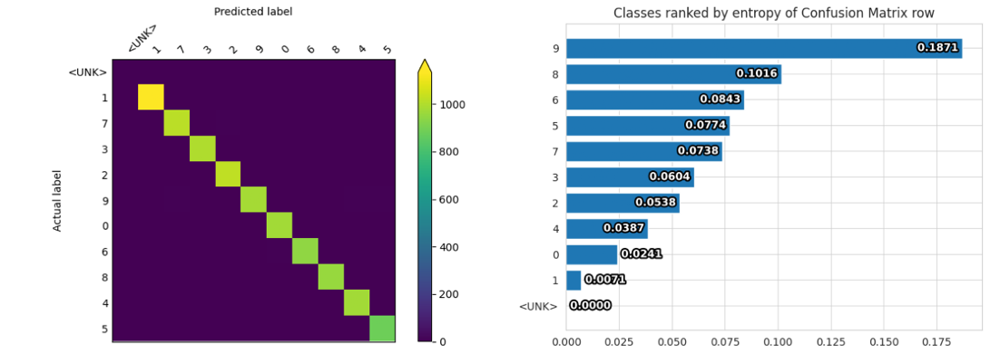
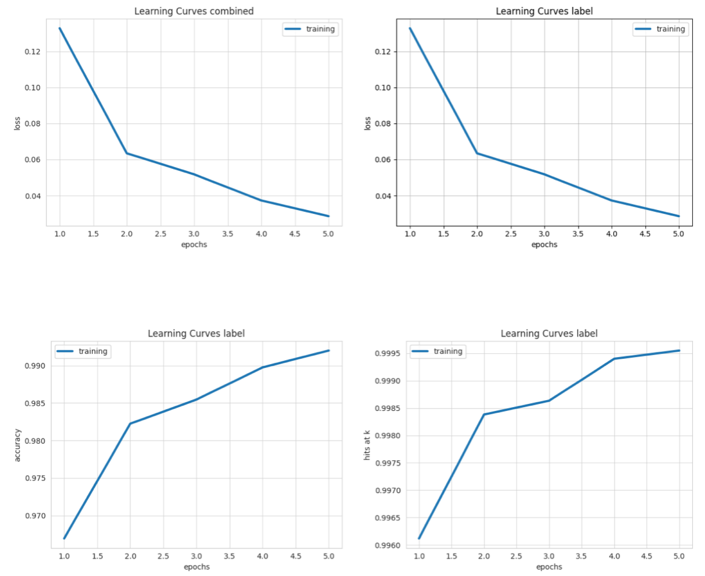

This is a complete example of Ludwig's hyperparameter optimization capability.

These interactive notebooks follow the steps of this example:

- Ludwig CLI: [](https://colab.research.google.com/github/ludwig-ai/ludwig-docs/blob/hyperopt-tutorial/docs/examples/hyperopt_notebooks/hyperopt_notebook_clie.ipynb)
- Ludwig Python API: [](https://colab.research.google.com/github/ludwig-ai/ludwig-docs/blob/hyperopt-tutorial/docs/examples/hyperopt_notebooks/hyperopt_notebook_api.ipynb)

## Download the Adult Census Income dataset

[Adult Census Income](https://archive.ics.uci.edu/ml/datasets/adult) is an extract of 1994 Census data for predicting whether a person's income exceeds $50K per year.  The data set consists of over 49K records with 14 attributes with missing data.

```shell
ludwig datasets download adult_census_income
```

This command will create a dataset `adult_census_income.csv` in the current directory.

The columns in the dataset are

| column         | description                                                  |
| -------------- | ------------------------------------------------------------ |
| age            | numeric variable, age of person                              |
| workclass      | categorical variable, Type of empolyment                     |
| fnlwgt         | numeric variable, no defintion                               |
| education      | categorical variable, education level                        |
| education-num  | nmeric variable, no definition                               |
| marital-status | categorical variable, marital status                         |
| occupation     | categorical variable, occupation                             |
| relationship   | categorical variable, Relationship to household              |
| race           | categorical variable, race                                   |
| sex            | categorical variable, gender                                 |
| capital-gain   | numeric variable, no definition                              |
| capital-loss   | numeric variable, no definition                              |
| hours-per-week | numeric variable, hours worked per week                      |
| native-country | categorical variable, Country of origin                      |
| income         | binary variable, " <=50K" or " >50K"                         |
| split          | numeric variable, indicating data split training(0), test(2) |


## Setup for hyperparameter optimization run

Hyperparameter optimization is defined with the `hyperopt` section of the Ludwig configuration specification.  


=== "cli"

    [ludwig hyperopt](../../user_guide/)

    ```yaml

    ```

=== "python"

    [Hyperopt Configuration](../../configuration/hyperparameter_optimization/)

    ```python
    # define model configuration
    config = {'combiner': {'dropout': 0.2,
                  'num_fc_layers': 3,
                  'output_size': 128,
                  'type': 'concat'},
     'input_features': [{'name': 'age', 'type': 'number'},
                        {'name': 'workclass', 'type': 'category'},
                        {'name': 'fnlwgt', 'type': 'number'},
                        {'name': 'education', 'type': 'category'},
                        {'name': 'education-num', 'type': 'number'},
                        {'name': 'marital-status', 'type': 'category'},
                        {'name': 'occupation', 'type': 'category'},
                        {'name': 'relationship', 'type': 'category'},
                        {'name': 'race', 'type': 'category'},
                        {'name': 'sex', 'type': 'category'},
                        {'name': 'capital-gain', 'type': 'number'},
                        {'name': 'capital-loss', 'type': 'number'},
                        {'name': 'hours-per-week', 'type': 'number'},
                        {'name': 'native-country', 'type': 'category'}],
     'output_features': [{'name': 'income',
                          'num_fc_layers': 4,
                          'output_size': 32,
                          'preprocessing': {'fallback_true_label': ' >50K'},
                          'loss': {'type': 'binary_weighted_cross_entropy'},
                          'type': 'binary'}],
     'preprocessing': {'number': {'missing_value_strategy': 'fill_with_mean',
                                  'normalization': 'zscore'}},
     'trainer': {'epochs': 5, 'optimizer': {'type': 'adam'}},
    
      # hyperopt specification template
      'hyperopt':  {
        # specify Ray Tune to executor to run the hyperparameter optimization
        'executor': {'type': 'ray', },
        # specify Ray Tune's basic search algorithm and set random seed for reproducibility
        'search_alg': {'type': 'variant_generator', 'random_state': 1919, },
        # maximize the metric score
        'goal': 'maximize',
        # metric score
        'metric': 'roc_auc',
        # name of output featue to optimize on
        'output_feature': 'income',
      }
    ```
    

## Random Search

EXPLAIN RANDOM SEARCH

=== "cli"

    [`ludwig train` command](../../user_guide/command_line_interface/#train)

    ```shell
    ludwig train \
      --dataset mnist_dataset.csv \
      --config config.yaml
    ```

=== "python"

    [train() method](../../user_guide/api/LudwigModel/#train)

    ```python
    # Trains the model. This cell might take a few minutes.
    train_stats, preprocessed_data, output_directory = model.train(dataset=train_df)
    ```

## Grid Search

EXPLAIN GRID SEARCH

=== "cli"

    [`ludwig evaluate` command](../../user_guide/command_line_interface/#evaluate)

    ```shell
    ludwig evaluate --model_path results/experiment_run/model \
                     --dataset mnist_dataset.csv \
                     --split test \
                     --output_directory test_results
    ```

=== "python"

    [evaluate() method](../../user_guide/api/LudwigModel/#evaluate)

    ```python
    # Generates predictions and performance statistics for the test set.
    test_stats, predictions, output_directory = model.evaluate(
      test_df,
      collect_predictions=True,
      collect_overall_stats=True
    )
    ```

## Visualize Hyperparameter Optimization Results

TO BE  UPDATED

=== "cli"

    [`ludwig visualize confusion_matrix` command](../../user_guide/visualizations/#confusion-matrix)

    ```shell
    ludwig visualize --visualization confusion_matrix \
                      --ground_truth_metadata results/experiment_run/model/training_set_metadata.json \
                      --test_statistics test_results/test_statistics.json \
                      --output_directory visualizations \
                      --file_format png
    ```

=== "python"

    [`visualize.confusion_matrix()` function](../../user_guide/api/visualization/#confusion_matrix)

    ```python
    # Visualizes confusion matrix, which gives an overview of classifier performance
    # for each class.
    from ludwig.visualize import confusion_matrix

    confusion_matrix(
      [test_stats],
      model.training_set_metadata,
      'label',
      top_n_classes=[5],
      model_names=[''],
      normalize=True,
    )
    ```



Display Learning Curves plots.

=== "cli"

    [`ludwig visualize learning_curves` command](../../user_guide/visualizations/#learning-curves)

    ```shell
    ludwig visualize --visualization learning_curves \
                      --ground_truth_metadata results/experiment_run/model/training_set_metadata.json \
                      --training_statistics results/experiment_run/training_statistics.json \
                      --file_format png \
                      --output_directory visualizations
    ```

=== "python"

    [`visualize.learning_curves()` function](../../ser_guide/api/visualization/#learning_curves)

    ```python
    # Visualizes learning curves, which show how performance metrics changed over
    # time during training.
    from ludwig.visualize import learning_curves

    learning_curves(train_stats, output_feature_name='label')
    ```



## Predictions

Generate predictions from test dataset.

=== "cli"

    [`ludwig predict` command](../../user_guide/command_line_interface/#predict)

    ```shell
    ludwig predict --model_path results/experiment_run/model \
                    --dataset mnist_dataset.csv \
                    --split test \
                    --output_directory predictions
    ```

=== "python"

    [`predict()` method](../../user_guide/api/LudwigModel/#predict)

    ```python
    predictions, output_directory = model.predict(test_df)
    ```

Sample test images displaying true("label") and predicted("pred") labels.

