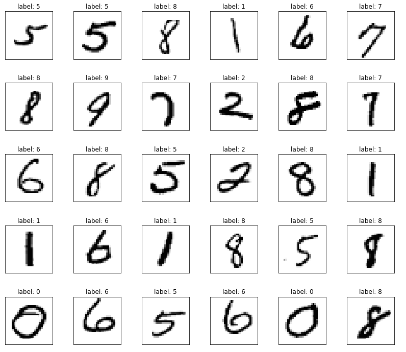
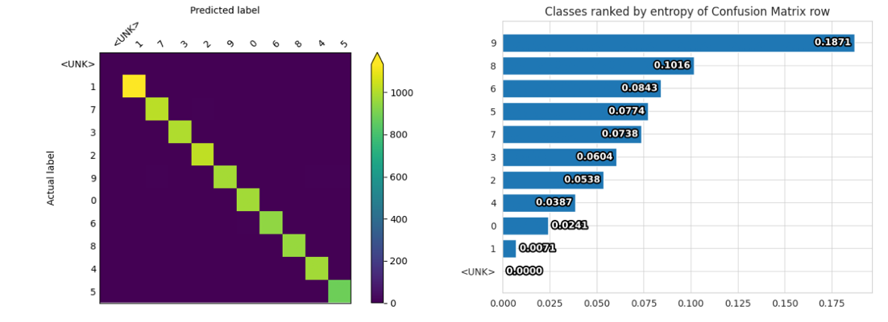
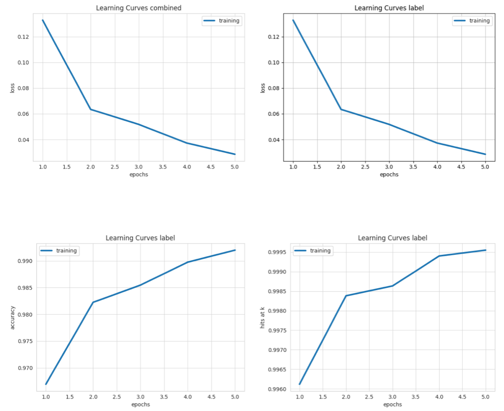
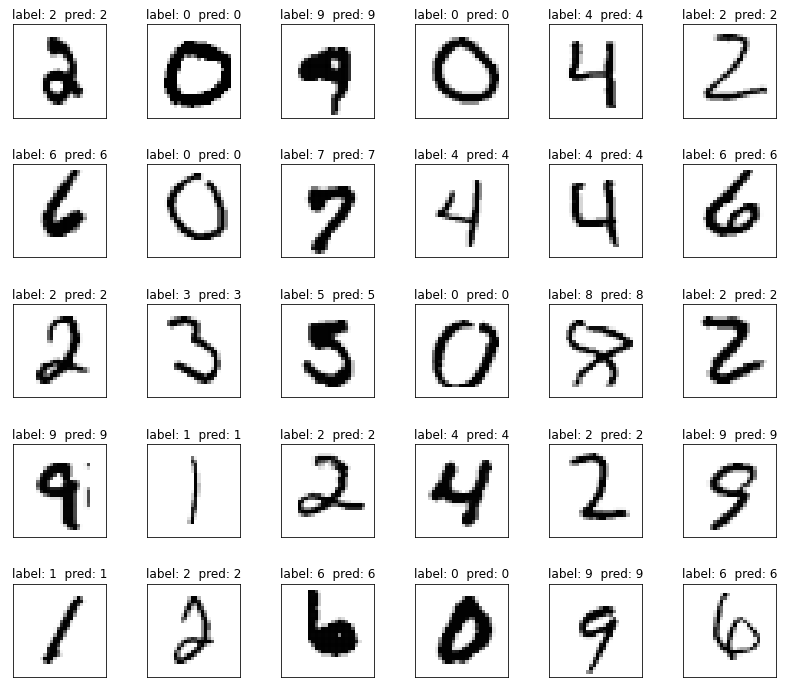

This is a complete example of training an image classification model on the MNIST handwritten digit
dataset.

These interactive notebooks follow the steps of this example:

**TODO: point notebook URL to ludwig-ai/ludwig-docs repo before PR merge**

- Ludwig CLI: [](https://colab.research.google.com/github/jimthompson5802/ludwig-docs/blob/expanded-mnist-example-with-colab/docs/examples/mnist_colab_notebooks/MNIST_Classification_with_Ludwig_CLI.ipynb)
- Ludwig Python API: [](https://colab.research.google.com/github/jimthompson5802/ludwig-docs/blob/expanded-mnist-example-with-colab/docs/examples/mnist_colab_notebooks/MNIST_Classification_with_Ludwig_API.ipynb)

## Download the MNIST dataset

[MNIST](http://yann.lecun.com/exdb/mnist/) is a collection of gray-scale images of handwritten digits. This collection is made up of 60,000 images for training and 10,000 images for testing model performance.  Each image is 28 X 28 pixels in gray-scale.

```shell
ludwig datasets download mnist
```

This command will create a dataset `mnist_dataset.csv` in the current directory.

The columns in the dataset are

|column| description |
|------|-------------|
|image_path|file path string for the image|
|label|single digit 0 to 9 indicating what digit is shown in the image|
|split|integer value indicating a training example (0) or test example (2)|

Sample of images with `label`.


## Train

The Ludwig configuration file describes the machine learning task. This example only uses a small subset of the options provided by Ludwig. Please refer to the [Configuration Section](../../configuration) for all the details.

First it defines the `input_features`.  For the image feature, the configuration specifies the type of neural network architecture to encode the image.  In this example the encoder is a two layer [Stacked Convolutional Neural Network](../../configuration/features/image_features/#convolutional-stack-encoder-stacked_cnn) followed by a fully connected layer with dropout regularization.

Next the `output_features` are defined.  In this case, there is only one output feature called `label`.  This is a [categorical feature](../../configuration/features/category_features/) that indicates the digit the image represents, 0, 1, 2, ..., 9.

The last section in this configuration file describes options for how the the [`trainer`](../../configuration/trainer/) will operate.  In this example the `trainer` will process the training data for 5 epochs.

=== "cli"

    ```yaml
    # config.yaml
    input_features:
    - name: image_path
      type: image
      encoder: stacked_cnn
      conv_layers:
        - num_filters: 32
          filter_size: 3
          pool_size: 2
          pool_stride: 2
        - num_filters: 64
          filter_size: 3
          pool_size: 2
          pool_stride: 2
          dropout: 0.4
      fc_layers:
        - output_size: 128
          dropout: 0.4

    output_features:
     - name: label
       type: category

    trainer:
      epochs: 5
    ```

=== "python"

    [LudwigModel](../../user_guide/api/LudwigModel/)

    ```python
    # create Ludwig configuration dictionary
    config = {
      'input_features': [
        {
          'name': 'image_path',
          'type': 'image',
          'preprocessing': {'num_processes': 4},
          'encoder': 'stacked_cnn',
          'conv_layers': [
            {'num_filters': 32, 'filter_size': 3, 'pool_size': 2, 'pool_stride': 2},
            {'num_filters': 64, 'filter_size': 3, 'pool_size': 2, 'pool_stride': 2, 'dropout': 0.4}
          ],
         'fc_layers': [{'output_size': 128, 'dropout': 0.4}]
        }
      ],
      'output_features': [{'name': 'label', 'type': 'category'}],
      'trainer': {'epochs': 5}
    }

    # Constructs Ludwig model from config dictionary
    model = LudwigModel(config, logging_level=logging.INFO)

    ```

Train the model.

=== "cli"

    [`ludwig train` command](../../user_guide/command_line_interface/#train)

    ```shell
    ludwig train \
      --dataset mnist_dataset.csv \
      --config config.yaml
    ```

=== "python"

    [train() method](../../user_guide/api/LudwigModel/#train)

    ```python
    # Trains the model. This cell might take a few minutes.
    train_stats, preprocessed_data, output_directory = model.train(dataset=train_df)
    ```

## Evaluate

Evaluate the trained model.

=== "cli"

    [`ludwig evaluate` command](../../user_guide/command_line_interface/#evaluate)

    ```shell
    ludwig evaluate --model_path results/experiment_run/model \
                     --dataset mnist_dataset.csv \
                     --split test \
                     --output_directory test_results
    ```

=== "python"

    [evaluate() method](../../user_guide/api/LudwigModel/#evaluate)

    ```python
    # Generates predictions and performance statistics for the test set.
    test_stats, predictions, output_directory = model.evaluate(
      test_df,
      collect_predictions=True,
      collect_overall_stats=True
    )
    ```

## Visualize Metrics

Display Confusion Matrix and Class Entropy plots.

=== "cli"

    [`ludwig visualize confusion_matrix` command](../../user_guide/visualizations/#confusion-matrix)

    ```shell
    ludwig visualize --visualization confusion_matrix \
                      --ground_truth_metadata results/experiment_run/model/training_set_metadata.json \
                      --test_statistics test_results/test_statistics.json \
                      --output_directory visualizations \
                      --file_format png
    ```

=== "python"

    [`visualize.confusion_matrix()` function](../../user_guide/api/visualization/#confusion_matrix)

    ```python
    # Visualizes confusion matrix, which gives an overview of classifier performance
    # for each class.
    from ludwig.visualize import confusion_matrix

    confusion_matrix(
      [test_stats],
      model.training_set_metadata,
      'label',
      top_n_classes=[5],
      model_names=[''],
      normalize=True,
    )
    ```



Display Learning Curves plots.

=== "cli"

    [`ludwig visualize learning_curves` command](../../user_guide/visualizations/#learning-curves)

    ```shell
    ludwig visualize --visualization learning_curves \
                      --ground_truth_metadata results/experiment_run/model/training_set_metadata.json \
                      --training_statistics results/experiment_run/training_statistics.json \
                      --file_format png \
                      --output_directory visualizations
    ```

=== "python"

    [`visualize.learning_curves()` function](../../ser_guide/api/visualization/#learning_curves)

    ```python
    # Visualizes learning curves, which show how performance metrics changed over
    # time during training.
    from ludwig.visualize import learning_curves

    learning_curves(train_stats, output_feature_name='label')
    ```



## Predictions

Generate predictions from test dataset.

=== "cli"

    [`ludwig predict` command](../../user_guide/command_line_interface/#predict)

    ```shell
    ludwig predict --model_path results/experiment_run/model \
                    --dataset mnist_dataset.csv \
                    --split test \
                    --output_directory predictions
    ```

=== "python"

    [`predict()` method](../../user_guide/api/LudwigModel/#predict)

    ```python
    predictions, output_directory = model.predict(test_df)
    ```

Sample test images displaying true("label") and predicted("pred") labels.

