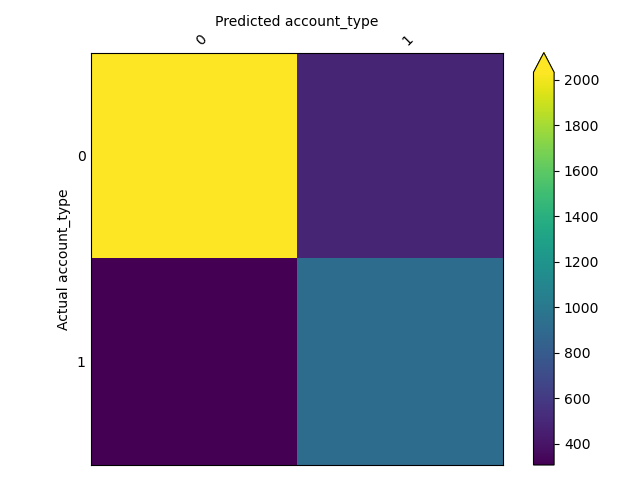
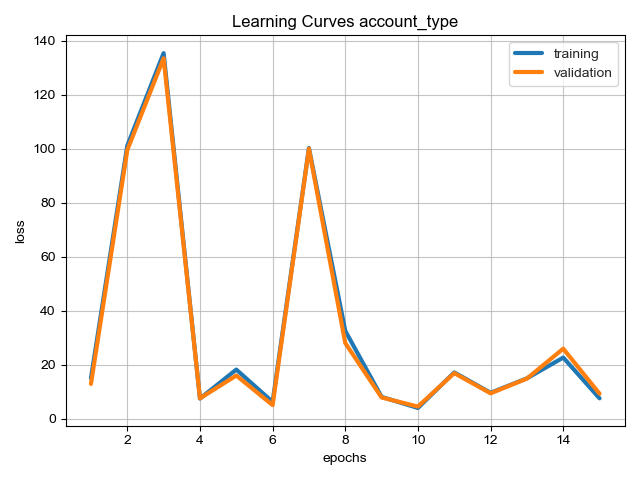
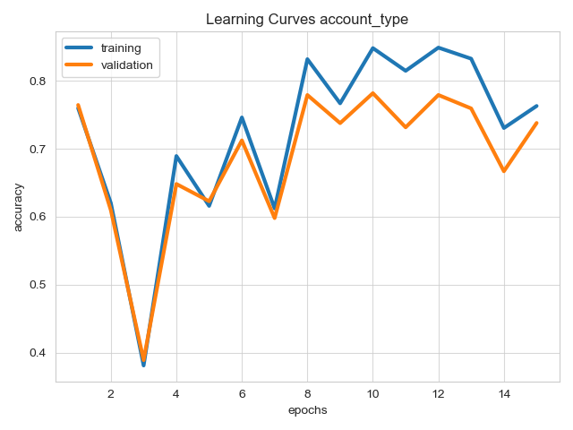

This example shows how to build a multimodal classifier with Ludwig.

We'll be using the twitter human-bots dataset, originally uploaded to Kaggle by
[David Martín Gutiérrez](https://www.kaggle.com/code/davidmartngutirrez/bots-accounts-eda/data). The dataset is composed
of 37438 rows each corresponding to a Twitter user account. Each row contains 20 feature columns collected via the
Twitter API. These features contain multiple data modalities, including the account description and the profile image.

The target column **account_type** has two unique values: **bot** or **human**. 25013 user accounts were annotated as
human accounts, the remaining 12425 are bots.

This dataset contains 20 columns, but we'll only use these 16 (15 input + 1 target):

| column      | type | description                                                                    |
|-------------|------|--------------------------------------------------------------------------------|
| default_profile | binary | Boolean indicating whether the account has a default profile             |
| default_profile_image | binary | Boolean indicating whether the account has a default profile image |
| description | text |  User account description                                                      |
| favorites_count | number | Total number of favorited tweets                                         |
| followers_count | number | Total number of followers                                                |
| friends_count | number | Total number of friends                                                    |
| geo_enabled | binary | Boolean indicating whether the account has the geographic location enabled   |
| lang | category | Language of the account                                                           |
| location | category | Location of the account                                                       |
| profile_background_image_path | image | Profile background image path                               |
| profile_image_path | image | Profile image path                                                     |
| statuses_count | number | Total number of tweets                                                    |
| verified | binary | Boolean indicating whether the account has been verified                        |
| average_tweets_per_day | number | Average tweets posted per day                                     |
| account_age_days | number | Account age measured in days                                            |
| account_type   | binary | Account type, one of {bot, human}                                       |

## Kaggle API Token (kaggle.json)

To download datasets using the Kaggle CLI, you'll need to get a Kaggle API Token.

1. [Sign in to Kaggle](https://kaggle.com/account/login). If you don't already have an account, create one.
2. Go to "Account", and click the "Create New API Token" button. This should start the download.

3. Following the Kaggle instructions, copy your `kaggle.json` from its download location to a directory called `.kaggle`
in your home directory.
4. If you want to run this example in either of the example Colab notebooks, open kaggle.json and copy its contents to
the clipboard. The kaggle.json file should look similar to:

```json
{"username":"your_user_name","key":"5da776d74a77013ef56c93f9d559166"}
```

These interactive notebooks follow the steps of this example:

- Ludwig CLI: [](https://colab.research.google.com/github/ludwig-ai/ludwig-docs/blob/daniel/twitter_bots_example/docs/examples/multimodal_classification/Multimodal_Classification_with_Ludwig_CLI.ipynb)
- Ludwig Python API: [](https://colab.research.google.com/github/ludwig-ai/ludwig-docs/blob/daniel/twitter_bots_example/docs/examples/multimodal_classification/Multimodal_Classification_with_Ludwig_Python_API.ipynb)

## Download Dataset

Downloads the dataset and creates `twitter_human_bots_dataset.csv` in the current directory.

```shell
# Downloads the dataset to the current working directory
kaggle datasets download danieltreiman/twitter-human-bots-dataset

# Unzips the downloaded dataset, creates twitter_human_bots_dataset.csv
unzip -q -o twitter-human-bots-dataset.zip
```

## Train

### Define ludwig config

The Ludwig config declares the machine learning task: which columns to use, their datatypes, and which columns to
predict.

=== "cli"

    With `config.yaml`:

    ```yaml
    input_features:
      - name: default_profile
        type: binary
      - name: default_profile_image
        type: binary
      - name: description
        type: text
      - name: favourites_count
        type: number
      - name: followers_count
        type: number
      - name: friends_count
        type: number
      - name: geo_enabled
        type: binary
      - name: lang
        type: category
      - name: location
        type: category
      - name: profile_background_image_path
        type: image
      - name: profile_image_path
        type: image
      - name: statuses_count
        type: number
      - name: verified
        type: binary
      - name: average_tweets_per_day
        type: number
      - name: account_age_days
        type: number
    output_features:
      - name: account_type
        type: binary
    ```

=== "python"

    With config defined in a python dict:

    ```python
    config = {
      "input_features": [
        {
          "name": "default_profile",
          "type": "binary",
        },
        {
          "name": "default_profile_image",
          "type": "binary",
        },
        {
          "name": "description",
          "type": "text",
        },
        {
          "name": "favourites_count",
          "type": "number",
        },
        {
          "name": "followers_count",
          "type": "number",
        },
        {
          "name": "friends_count",
          "type": "number",
        },
        {
          "name": "geo_enabled",
          "type": "binary",
        },
        {
          "name": "lang",
          "type": "category",
        },
        {
          "name": "location",
          "type": "category",
        },
        {
          "name": "profile_background_image_path",
          "type": "image",
        },
        {
          "name": "profile_image_path",
          "type": "image",
        },
        {
          "name": "statuses_count",
          "type": "number",
        },
        {
          "name": "verified",
          "type": "binary",
        },
        {
          "name": "average_tweets_per_day",
          "type": "number",
        },
        {
          "name": "account_age_days",
          "type": "number",
        },
      ],
      "output_features": [
        {
          "name": "account_type",
          "type": "category",
        }
      ]
    }
    ```

### Create and train a model

=== "cli"

    ```shell
    ludwig train --dataset twitter_human_bots_dataset.csv -c config.yaml
    ```

=== "python"

    ```python
    import pandas as pd

    # Reads the dataset from CSV file.
    dataset_df = pd.read_csv("twitter_human_bots_dataset.csv")

    # Constructs Ludwig model from config dictionary
    model = LudwigModel(config, logging_level=logging.INFO)

    # Trains the model. This cell might take a few minutes.
    train_stats, preprocessed_data, output_directory = model.train(dataset=dataset_df)
    ```

## Evaluate

Generates predictions and performance statistics for the test set.

=== "cli"

    ```shell
    ludwig evaluate \
        --model_path results/experiment_run/model \
        --dataset twitter_human_bots_dataset.csv \
        --split test \
        --output_directory test_results
    ```

=== "python"

    ```python
    # Generates predictions and performance statistics for the test set.
    test_stats, predictions, output_directory = model.evaluate(
      dataset_df[dataset_df.split == 1],
      collect_predictions=True,
      collect_overall_stats=True
    )
    ```

## Visualize Metrics

Visualizes confusion matrix, which gives an overview of classifier performance for each class.

=== "cli"

    ```shell
    ludwig visualize \
        --visualization confusion_matrix \
        --ground_truth_metadata results/experiment_run/model/training_set_metadata.json \
        --test_statistics test_results/test_statistics.json \
        --output_directory visualizations \
        --file_format png
    ```

=== "python"

    ```python
    from ludwig.visualize import confusion_matrix

    confusion_matrix(
      [test_stats],
      model.training_set_metadata,
      'account_type',
      labels=['human', 'bot'],
      top_n_classes=[2],
      model_names=[''],
      normalize=True,
    )
    ```

| Confusion Matrix                                                     | Class Entropy                                                                        |
| -------------------------------------------------------------------- | ------------------------------------------------------------------------------------ |
|  |  |

Visualizes learning curves, which show how performance metrics changed over time during training.

=== "cli"

    ```shell
    ludwig visualize \
        --visualization learning_curves \
        --ground_truth_metadata results/experiment_run/model/training_set_metadata.json \
        --training_statistics results/experiment_run/training_statistics.json \
        --file_format png \
        --output_directory visualizations
    ```

=== "python"

    ```python
    # Visualizes learning curves, which show how performance metrics changed over time during training.
    from ludwig.visualize import learning_curves

    learning_curves(train_stats, output_feature_name='account_type')
    ```

| Losses                                                                | Metrics                                                    |
| --------------------------------------------------------------------- | ---------------------------------------------------------- |
|        |  |
