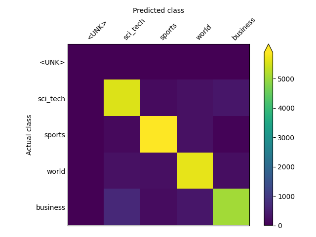
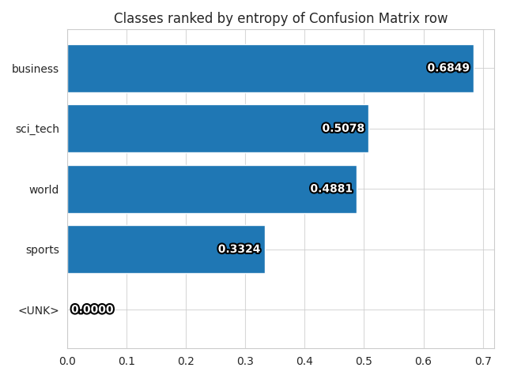
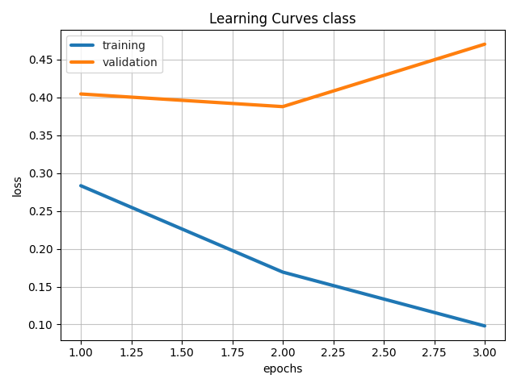
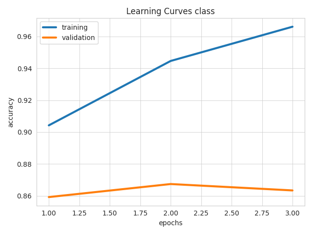
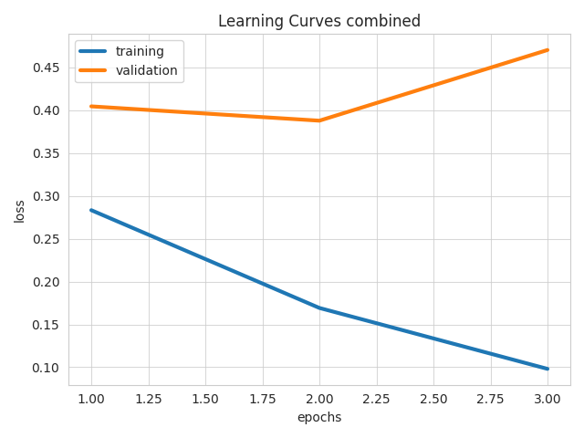
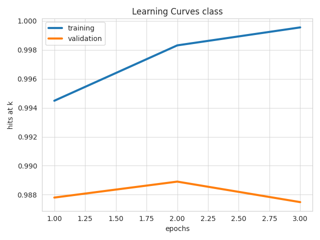

This example shows how to build a multimodal classifier with Ludwig.

We'll be using the twitter human-bots dataset, originally uploaded to Kaggle by
[David Martín Gutiérrez](https://www.kaggle.com/code/davidmartngutirrez/bots-accounts-eda/data). The dataset is composed
of 37438 rows each corresponding to a Twitter user account. Each row contains 20 feature columns collected via the
Twitter API. These features contain multiple data modalities, including the account description and the profile image.

The target column **account_type** has two unique values: **bot** or **human**. 25013 user accounts were annotated as
human accounts, the remaining 12425 are bots.

This dataset contains 20 columns, but we'll only use these 16 (15 input + 1 target):

| column      | type | description                                                                    |
|-------------|------|--------------------------------------------------------------------------------|
| default_profile | binary | Boolean indicating whether the account has a default profile             |
| default_profile_image | binary | Boolean indicating whether the account has a default profile image |
| description | text |  User account description                                                      |
| favorites_count | number | Total number of favorited tweets                                         |
| followers_count | number | Total number of followers                                                |
| friends_count | number | Total number of friends                                                    |
| geo_enabled | binary | Boolean indicating whether the account has the geographic location enabled   |
| lang | category | Language of the account                                                           |
| location | category | Location of the account                                                       |
| profile_background_image_url | image | Profile background image url                                 |
| profile_image_url | image | Profile image url                                                       |
| statuses_count | number | Total number of tweets                                                    |
| verified | binary | Boolean indicating whether the account has been verified                        |
| average_tweets_per_day | number | Average tweets posted per day                                     |
| account_age_days | number | Account age measured in days                                            |
| account_type   | category | Account type, one of {bot, human}                                       |

## Kaggle API Token (kaggle.json)

To download datasets using the Kaggle CLI, you'll need to get a Kaggle API Token.

1. [Sign in to Kaggle](https://kaggle.com/account/login). If you don't already have an account, create one.
2. Go to "Account", and click the "Create New API Token" button. This should start the download.

3. Following the Kaggle instructions, copy your `kaggle.json` from its download location to a directory called `.kaggle`
in your home directory.
4. If you want to run this example in either of the example Colab notebooks, open kaggle.json and copy its contents to
the clipboard. The kaggle.json file should look similar to:

```json
{"username":"your_user_name","key":"5da776d74a77013ef56c93f9d559166"}
```

These interactive notebooks follow the steps of this example:

- Ludwig CLI: [](https://colab.research.google.com/github/ludwig-ai/ludwig-docs/blob/daniel/text_classification/docs/examples/text_classification/Text_Classification_with_Ludwig_CLI.ipynb)
- Ludwig Python API: [](https://colab.research.google.com/github/ludwig-ai/ludwig-docs/blob/daniel/text_classification/docs/examples/text_classification/Text_Classification_with_Ludwig_Python_API.ipynb)

## Download Dataset

=== "cli"

    Downloads the dataset and write to `agnews.csv` in the current directory.

    ```shell
    ludwig datasets download agnews
    ```

=== "python"

    Downloads the AG news dataset into a pandas dataframe.

    ```python
    from ludwig.datasets import agnews

    # Loads the dataset as a pandas.DataFrame
    train_df, test_df, _ = agnews.load()
    ```

The dataset contains the above four columns plus an additional `split` column which is one of 0: train, 1: test,
2: validation.

Sample (description text omitted for space):

```
class_index,title,description,split,class
3,Carlyle Looks Toward Commercial Aerospace (Reuters),...,0,business
3,Oil and Economy Cloud Stocks' Outlook (Reuters),...,0,business
3,Iraq Halts Oil Exports from Main Southern Pipeline (Reuters),...,0,business
```

## Train

### Define ludwig config

The Ludwig config declares the machine learning task. It tells Ludwig what to predict, what columns to use as input, and
optionally specifies the model type and hyperparameters.

Here, for simplicity, we'll try to predict **class** from **title**.

=== "cli"

    With `config.yaml`:

    ```yaml
    input_features:
        -
            name: title
            type: text
            encoder: parallel_cnn
    output_features:
        -
            name: class
            type: category
    trainer:
        epochs: 3
    ```

=== "python"

    With config defined in a python dict:

    ```python
    config = {
      "input_features": [
        {
          "name": "title",            # The name of the input column
          "type": "text",             # Data type of the input column
          "encoder": "parallel_cnn",  # The model architecture we should use for
                                      # encoding this column
        }
      ],
      "output_features": [
        {
          "name": "class",
          "type": "category",
        }
      ],
      "trainer": {
        "epochs": 3,  # We'll train for three epochs. Training longer might give
                      # better performance.
      }
    }
    ```

### Create and train a model

=== "cli"

    ```shell
    ludwig train --dataset agnews.csv -c config.yaml
    ```

=== "python"

    ```python
    # Constructs Ludwig model from config dictionary
    model = LudwigModel(config, logging_level=logging.INFO)

    # Trains the model. This cell might take a few minutes.
    train_stats, preprocessed_data, output_directory = model.train(dataset=train_df)
    ```

## Evaluate

Generates predictions and performance statistics for the test set.

=== "cli"

    ```shell
    ludwig evaluate \
        --model_path results/experiment_run/model \
        --dataset agnews.csv \
        --split test \
        --output_directory test_results
    ```

=== "python"

    ```python
    # Generates predictions and performance statistics for the test set.
    test_stats, predictions, output_directory = model.evaluate(
      test_df,
      collect_predictions=True,
      collect_overall_stats=True
    )
    ```

## Visualize Metrics

Visualizes confusion matrix, which gives an overview of classifier performance for each class.

=== "cli"

    ```shell
    ludwig visualize \
        --visualization confusion_matrix \
        --ground_truth_metadata results/experiment_run/model/training_set_metadata.json \
        --test_statistics test_results/test_statistics.json \
        --output_directory visualizations \
        --file_format png
    ```

=== "python"

    ```python
    from ludwig.visualize import confusion_matrix

    confusion_matrix(
      [test_stats],
      model.training_set_metadata,
      'class',
      top_n_classes=[5],
      model_names=[''],
      normalize=True,
    )
    ```

| Confusion Matrix                                                     | Class Entropy                                                                        |
| -------------------------------------------------------------------- | ------------------------------------------------------------------------------------ |
|  |  |

Visualizes learning curves, which show how performance metrics changed over time during training.

=== "cli"

    ```shell
    ludwig visualize \
        --visualization learning_curves \
        --ground_truth_metadata results/experiment_run/model/training_set_metadata.json \
        --training_statistics results/experiment_run/training_statistics.json \
        --file_format png \
        --output_directory visualizations
    ```

=== "python"

    ```python
    # Visualizes learning curves, which show how performance metrics changed over
    # time during training.
    from ludwig.visualize import learning_curves

    learning_curves(train_stats, output_feature_name='class')
    ```

| Losses                                                                | Metrics                                                    |
| --------------------------------------------------------------------- | ---------------------------------------------------------- |
|        |  |
|  |      |

## Make Predictions on New Data

Lastly we'll show how to generate predictions for new data.

The following are some recent news headlines. Feel free to edit or add your own strings to text_to_predict to see how
the newly trained model classifies them.

=== "cli"

    With `text_to_predict.csv`:

    ```
    title
    Google may spur cloud cybersecurity M&A with $5.4B Mandiant buy
    Europe struggles to meet mounting needs of Ukraine's fleeing millions
    How the pandemic housing market spurred buyer's remorse across America
    ```

    ```shell
    ludwig predict \
        --model_path results/experiment_run/model \
        --dataset text_to_predict.csv \
        --output_directory predictions
    ```

=== "python"

    ```python
    text_to_predict = pd.DataFrame({
      "title": [
        "Google may spur cloud cybersecurity M&A with $5.4B Mandiant buy",
        "Europe struggles to meet mounting needs of Ukraine's fleeing millions",
        "How the pandemic housing market spurred buyer's remorse across America",
      ]
    })

    predictions, output_directory = model.predict(text_to_predict)
    ```

This command will write predictions to `output_directory`. Predictions outputs are written in multiple formats including
csv and parquet. For instance, `predictions/predictions.parquet` contains the predicted classes for each example as well
as the psuedo-probabilities for each class:

| class_predictions | class_probabilities          | class_probability | class_probabilities_&lt;UNK&gt; | class_probabilities_sci_tech | class_probabilities_sports | class_probabilities_world | class_probabilities_business |
| ----------------- | ---------------------------- | ----------------- | ------------------------------- | ---------------------------- | -------------------------- | ------------------------- | ---------------------------- |
| sci_tech          | [1.9864278277825775e-10, ... | 0.954650          | 1.986428e-10                    | 0.954650                     | 0.000033                   | 0.002563                  | 0.042754                     |
| world             | [8.458710176739714e-09, ...  | 0.995293          | 8.458710e-09                    | 0.002305                     | 0.000379                   | 0.995293                  | 0.002022                     |
| business          | [3.710099008458201e-06, ...  | 0.490741          | 3.710099e-06                    | 0.447916                     | 0.000815                   | 0.060523                  | 0.490741                     |
