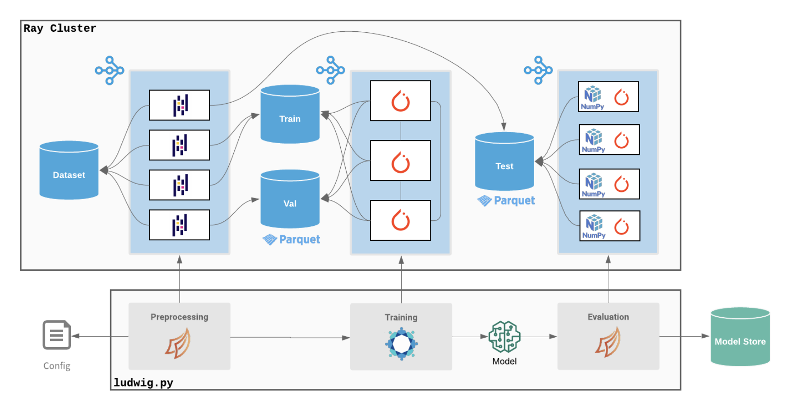

For large datasets, training on a single machine storing the entire dataset in memory can be prohibitively expensive. As such,
Ludwig supports distributing the preprocessing, training, and prediction steps across multiple machines and GPUs to
operate on separate partitions of the data in parallel.



Ludwig supports distributed execution through the [Ray backend](../../configuration/backend.md), with distributed data
processing via Dask and distributed training powered by [HuggingFace Accelerate](https://github.com/huggingface/accelerate).

# Distributed Training Strategy

Ludwig uses [HuggingFace Accelerate](https://github.com/huggingface/accelerate) as its distributed training backend,
which provides a unified interface for training across DDP, FSDP, and DeepSpeed configurations without requiring
changes to your Ludwig config.

By default, Ludwig automatically selects the best training strategy for your hardware. You can also specify it
explicitly in the backend config:

```yaml
backend:
  type: ray
  processor:
    type: dask
  trainer:
    strategy: auto  # auto, ddp, fsdp, or deepspeed
```

The `auto` strategy (default) will use DDP for most models and FSDP or DeepSpeed when training very large models
that don't fit in GPU memory.

# Ray

[Ray](https://ray.io/) is a framework for distributed computing that makes it easy to scale up code that runs on your
local machine to execute in parallel across a cluster.

Ludwig has native integration with Ray for both hyperparameter search and distributed training.

Running with Ray has several advantages over local execution:

- Ray enables you to provision a cluster of machines in a single command through its [cluster launcher](https://docs.ray.io/en/latest/cluster/launcher.html).
- Dask on Ray allows you to process large datasets that don't fit in memory on a single machine.
- Ray Tune allows you to easily run distributed hyperparameter search across many machines in parallel.
- Ray provides easy access to high performance instances like high memory or GPU machines in the cloud.

All of this comes for free without changing a single line of code in Ludwig. When Ludwig detects that you're running
within a Ray cluster, the Ray backend will be enabled automatically. You can also enable the Ray backend explicitly
either through the command line:

```bash
ludwig train ... --backend ray
```

Or in the Ludwig config:

```yaml
backend:
  type: ray
  processor:
    type: dask
```

## Running Ludwig with Ray

To use the Ray with Ludwig, you will need to have a running Ray cluster. The simplest way to start a Ray cluster is to
use the Ray [cluster launcher](https://docs.ray.io/en/latest/cluster/launcher.html), which can be installed locally
with `pip`:

```bash
pip install ray
```

Starting a Ray cluster requires that you have access to a cloud instance provider like AWS EC2 or Kubernetes.

Here's an example of a partial Ray cluster configuration YAML file you can use to create your Ludwig Ray cluster:

```yaml
cluster_name: ludwig-ray-gpu-latest

min_workers: 4
max_workers: 4

docker:
    image: "ludwigai/ludwig-ray-gpu:latest"
    container_name: "ray_container"

head_node:
    InstanceType: m5.2xlarge
    ImageId: latest_dlami

worker_nodes:
    InstanceType: g4dn.2xlarge
    ImageId: latest_dlami
```

This configuration runs on AWS EC2 instances, with a CPU head node and 4 GPU (Nvidia T4) worker nodes. Every worker runs
within a Docker image that provides Ludwig and its dependencies, including Ray, Dask, etc. You can use one of
these pre-built Docker images as the parent image for your cluster. Ludwig provides both
[CPU](https://hub.docker.com/r/ludwigai/ludwig-ray) and [GPU](https://hub.docker.com/r/ludwigai/ludwig-ray-gpu) images
ready for use with Ray.

Once your Ray cluster is configured, you can start the cluster and submit your existing `ludwig` commands or Python
files to Ray for distributed execution:

```bash
ray up cluster.yaml
ray submit cluster.yaml \
    ludwig train --config config.yaml --dataset s3://mybucket/dataset.parquet
```

## Best Practices

### Cloud Storage

In order for Ray to preprocess the input `dataset`, the dataset file path must be readable
from every worker. There are a few ways to achieve this:

- Replicate the input dataset to the local filesystem of every worker (suitable for small datasets).
- Use a network mounted filesystem like [NFS](https://en.wikipedia.org/wiki/Network_File_System).
- Use an object storage system like [Amazon S3](https://aws.amazon.com/s3/).

In most cases, we recommend using an object storage system such as [S3](https://aws.amazon.com/s3/) (AWS),
[GCS](https://cloud.google.com/storage) (GCP), or [ADLS](https://learn.microsoft.com/en-us/azure/storage/common/storage-introduction) (Azure).

To connect to one of these systems from Ludwig you need two things:

1. Install the appropriate filesystem driver package into your Python environment:

    ```txt
    s3fs   # S3
    adlfs  # Azure Storage
    gcsfs  # GCS
    ```

2. Mount your credentials file or set the correct environment variables (example: [S3](https://boto3.amazonaws.com/v1/documentation/api/latest/guide/configuration.html#using-environment-variables)) in your container.

See [Cloud Storage](../cloud_storage.md) for more detailed instructions for each major filesystem.

### Autoscaling Clusters

By default, Ludwig on Ray will attempt to use all available GPUs for distributed training. However, if running in an autoscaling
clusters there may not be any GPUs in the cluster at the time Ludwig performs its check. In such cases, we recommend setting the
number of GPU workers explicitly in the config.

For example, to train with 4 GPUs:

```yaml
backend:
  trainer:
    use_gpu: true
    num_workers: 4
```

When using [Hyperopt](../hyperopt.md) in an autoscaling cluster, you should set `max_concurrent_trials` and `gpu_resources_per_trial`,
otherwise Ludwig will similarly underestimate how many trials can fit in the fully autoscaled cluster at a time:

```yaml
hyperopt:
  executor:
    max_concurrent_trials: 4
    gpu_resources_per_trial: 1
```
