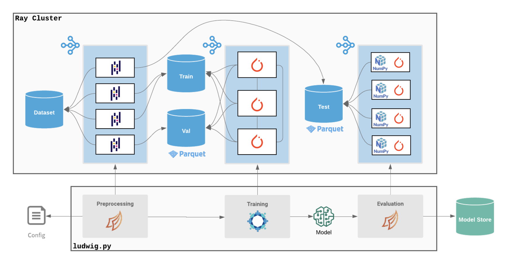

<!-- markdownlint-disable MD033 -->
# Configuration

Ludwig provides an expressive declarative configuration system for how users construct their ML pipeline, like data preprocessing, model architecting, backend infrastructure, the training loop, hyperparameter optimization, and more.

See [Ludwig configurations](../../configuration) for an in-depth reference.

# Data type abstractions

Every feature in Ludwig is described by a specific data type.
Each data type maps to a specific set of modules that handle preprocessing, encoding, decoding, and post-processing for that type.
Vice versa, every module (preprocessor, encoder, decoder) is registered to a specific set of data types that the module supports.

[Binary](../configuration/features/binary_features.md){ .md-button }
[Number](../configuration/features/number_features.md){ .md-button }
[Category](../configuration/features/category_features.md){ .md-button }
[Bag](../configuration/features/bag_features.md){ .md-button }
[Set](../configuration/features/set_features.md){ .md-button }
[Sequence](../configuration/features/sequence_features.md){ .md-button }
[Text](../configuration/features/text_features.md){ .md-button }
[Vector](../configuration/features/vector_features.md){ .md-button }
[Audio](../configuration/features/audio_features.md){ .md-button }
[Date](../configuration/features/date_features.md){ .md-button }
[H3](../configuration/features/h3_features.md){ .md-button }
[Image](../configuration/features/image_features.md){ .md-button }
[Timeseries](../configuration/features/time_series_features.md){ .md-button }

Read more about [Ludwig's supported feature types](../../configuration/features/supported_data_types).

# ECD Architecture

Ludwig’s core modeling architecture is referred to as ECD (encoder-combiner-decoder).
Multiple input features are encoded and fed through the [Combiner](../../configuration/combiner) model that operates on encoded inputs to combine them.
On the output side, the combiner model's outputs are fed to decoders for each output feature for predictions and post-processing.
Find out [more](../../configuration/combiner) about Ludwig's Combiner models like [TabNet](https://arxiv.org/abs/1908.07442), Transformer, and Concat ([Wide and Deep learning](https://ai.googleblog.com/2016/06/wide-deep-learning-better-together-with.html)).

Visualized, the ECD architecture looks like a butterfly and sometimes we refer to it as the “butterfly architecture”.

ECD flexibly handles many different combinations of input and output data types, making the tool well-suited for many different applications.

Take a look at [Examples](../../examples) to see how you can use Ludwig for several many different applications.

# Distributed training, data processing, and hyperparameter search with Ray

**Ludwig on Ray** is a new backend introduced in v0.4 that enables users can scale their training process from running on their local laptop, to running in the cloud on a GPU instance, to scaling across hundreds of machines in parallel, all without changing a single line of code.

By integrating with Ray, Ludwig is able to provide a unified way for doing distributed training:

- Ray enables you to provision a cluster of machines in a single command through its [cluster launcher](https://docs.ray.io/en/releases-0.8.7/cluster/launcher.html).
- [Horovod on Ray](https://horovod.readthedocs.io/en/stable/ray_include.html) enables you to do distributed training without needing to configure MPI in your environment.
- [Dask on Ray](https://docs.ray.io/en/latest/data/dask-on-ray.html) enables you to process large datasets that don’t fit in memory on a single machine.
- [Ray Tune](https://docs.ray.io/en/master/tune/index.html) enables you to easily run distributed hyperparameter search across many machines in parallel.
