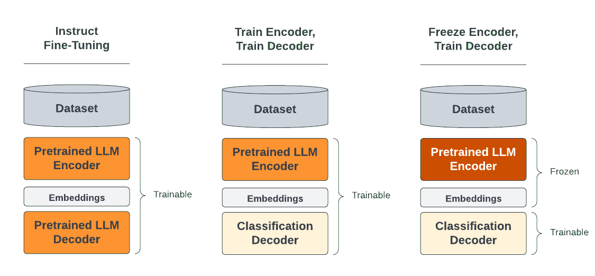

Fine-tuning is the process of modifying the weights of a Large Language Model to help it
perform better on a specific task or set of tasks.

In this section, we'll cover the options Ludwig offers for fine-tuning, and provide guidance on when
to use which techniques depending on your task.

## Generative vs Predictive Fine-Tuning

Ludwig offers fine-tuning capabilities for both *generative* and *predictive* tasks. Generative tasks are supported via the `llm` model type,
while predictive tasks are supported through the `ecd` model type when using a large language model as a pretrained text encoder.

For generative tasks like chatbots and code generation, fine-tuning both the language model’s encoder (which produces embeddings) and its decoder (which produces next token probabilities) is the straightforward and preferred approach. This is supported neatly in Ludwig by the previously shown example config above.

For predictive tasks, the temptation is often to take an existing text generation model and fine-tune it to generate text that matches a specific category in a multi-class classification problem, or a specific number for a regression problem. However, the result is a model that comes with a couple of drawbacks:

- *Text generation models are slow to make predictions*. Particularly auto-regressive models (of which Llama and most popular LLMs are considered) require generating text one token at a time, which is many times slower than generating a single output.
- *Text generation models can hallucinate*. This can be mitigated by using conditional decoding strategies, but if you only want a model that can output one of N distinct outputs, having a model that can output anything is overkill.

For such predictive (classification, regression) tasks, the solution is to remove the language model head / decoder at the end of the LLM, and replace it with a task-specific head / decoder (usually a simple multi-layer perceptron). The task-specific head at the end can then be quickly trained on the task-specific dataset, while the pretrained LLM encoder is either minimally adjusted (with parameter efficient fine-tuning) or held constant. When holding the LLM weights constant (also known as “linear probing”), the training process can further benefit from Ludwig optimizations like [cached encoder embeddings](../distributed_training/finetuning.md#cache-encoder-embeddings) for up to a 50x speedup.



You can find an example of generative fine-tuning [here](https://github.com/ludwig-ai/ludwig/tree/master/examples/llama2_7b_finetuning_4bit).

You can find an example of predictive fine-tuning [here](https://github.com/ludwig-ai/ludwig/tree/master/examples/llm_finetuning).

For full details on configuring LLM fine-tuning, see the [Configuration docs](../../configuration/large_language_model.md).

## Loading Fine-Tuned Weights from Local

After a model is fine-tuned, the updated weights are automatically saved locally, and the output directory can be found at the end of the model logs:


These weights can then be loaded in directly using [LudwigModel.load](../api/LudwigModel.md#load):

```ludwig_model = LudwigModel.load("results/experiment_run/model")```

## Uploading to HuggingFace Hub

Should the weights need to be made public or stored remotely, they can be uploaded directly to HuggingFace and deployed to an endpoint
or shared with other users even outside of Ludwig.

=== "CLI"

    ``` sh
    ludwig upload hf_hub -r <your_org>/<model_name> -m <path/to/model>
    ```

=== "Python"

    ``` python
    from ludwig.api import LudwigModel

    LudwigModel.upload_to_hf_hub("your_org/model_name", "path/to/model")
    ```