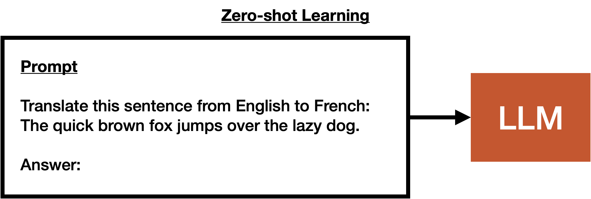
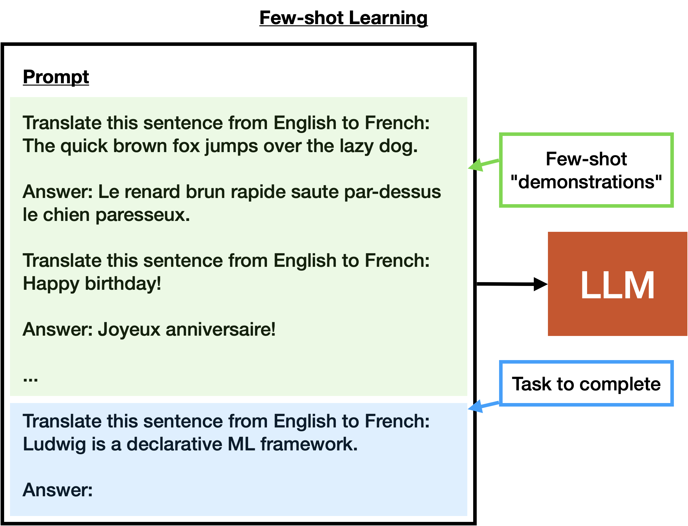
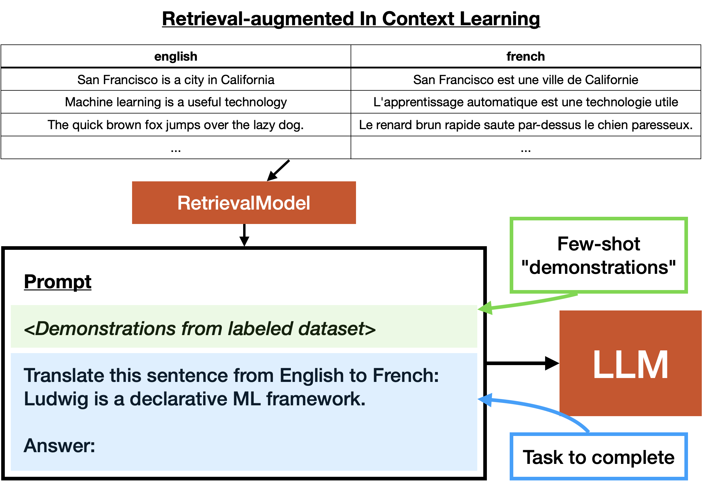

## Background: Zero-Shot Learning

Zero-shot learning is a capability enabled by Large Language Models, allowing them to generalize to tasks or domains they have never been explicitly trained on. This approach leverages the inherent knowledge and linguistic understanding encoded within the model during its pretraining phase.

Zero-shot learning involves presenting the model with a task description or prompt, along with some context, and expecting it to generate a relevant response or output. The key idea is that the model can understand and generate coherent content even for tasks it hasn't been explicitly fine-tuned for.

Concretely, zero-shot learning is the action taken when a user provides a prompt to an LLM that is not explicitly trained to perform the task described by the prompt. For example, if a user provides the prompt `translate from English to French:`, followed by some English text, the LLM will generate French text that is a translation of the English text. The LLM may not have necessarily been trained on this task, but it is able to do so because it has been trained to understand the structure of language.

You can find an example of zero-shot learning [here](https://github.com/ludwig-ai/ludwig/tree/master/examples/llm_zero_shot_learning).

## Few-Shot Learning

Few-shot learning is a variant of zero-shot learning that involves providing a static set of labeled examples to the model in order to help it perform the task. For example, if a user provides the prompt `translate from English to French:`, followed by a few English-French translation pairs, followed by the English text to translate, the LLM will generate French text that is a translation of the English text.

This often results in better performance than zero-shot learning, but requires a small amount of labeled data. The amount of data required can range greatly, from a single example to a few hundred. The exact amount of data required depends on the task, the maximum context length of the LLM, and the relative strength of the model.

To implement this in Ludwig, you can use the zero-shot learning [example](https://github.com/ludwig-ai/ludwig/tree/master/examples/llm_zero_shot_learning) and provide a few labeled examples in the `prompt.task` field of the config.

## Retrieval-Augmented ICL

Retrieval-augmented in-context learning is a variant of in-context learning that involves using an information retrieval process to insert additional context into the prompt. This is often done by using a text embedding model to encode a database of text pairs (typically an input text its corresponding desired response text), and then using the nearest neighbor of the encoded prompt to insert additional context into the prompt.

This is related to few-shot learning in that we inject labeled data into the prompt. The difference is that the "shots" included in the prompt are dynamic, not static. We may have many more examples than can fit into the prompt, and we use a retrieval process to select the most relevant examples to include in the prompt.

As an example, assume the user has a dataset of a few hundred English-French text pairs. If the user has an inputs that is a single English text, and a prompt that is `translate from English to French:`, the user can use a retrieval process to select the most relevant English-French text pairs to include in the prompt. This will help the LLM perform the translation task.

It's possible that this performs better than few-shot learning, since the retrieval process can dynamically select the most relevant examples to include in the prompt. However, it requires a larger amount of labeled data, and the retrieval process can be slow.

You can find an example of retrieval-augmented ICL [here](https://github.com/ludwig-ai/ludwig/tree/master/examples/llm_few_shot_learning).

To learn more about how to specify prompts and retrieval strategies for LLMs in Ludwig, check out the prompt section in the [LLM Configuration Docs](../../configuration/large_language_model.md).