Visualize Command
=================

Several visualization can be obtained from the result files from both `train`, `predict` and `experiment` by using the `visualize` command.
The command has several parameters, but not all the visualizations use all of them.
Let's first present the parameters of the general script, and then, for each available visualization, we will discuss about the specific parameters needed and what visualization they produce.

```
usage: ludwig visualize [options]

This script analyzes results and shows some nice plots.

optional arguments:
  -h, --help            show this help message and exit
  -g GROUND_TRUTH, --ground_truth GROUND_TRUTH
                        ground truth file
  -sf SPLIT_FILE, --split_file SPLIT_FILE
                        file containing split values used in conjunction with ground truth file
  -gm GROUND_TRUTH_METADATA, --ground_truth_metadata GROUND_TRUTH_METADATA
                        input metadata JSON file
  -od OUTPUT_DIRECTORY, --output_directory OUTPUT_DIRECTORY
                        directory where to save plots.If not specified, plots
                        will be displayed in a window
  -ff {pdf,png}, --file_format {pdf,png}
                        file format of output plots
  -v {binary_threshold_vs_metric,calibration_1_vs_all,calibration_multiclass,compare_classifiers_multiclass_multimetric,compare_classifiers_performance_changing_k,compare_classifiers_performance_from_pred,compare_classifiers_performance_from_prob,compare_classifiers_performance_subset,compare_classifiers_predictions,compare_classifiers_predictions_distribution,compare_performance,confidence_thresholding,confidence_thresholding_2thresholds_2d,confidence_thresholding_2thresholds_3d,confidence_thresholding_data_vs_acc,confidence_thresholding_data_vs_acc_subset,confidence_thresholding_data_vs_acc_subset_per_class,confusion_matrix,frequency_vs_f1,hyperopt_hiplot,hyperopt_report,learning_curves,roc_curves,roc_curves_from_test_statistics}, --visualization {binary_threshold_vs_metric,calibration_1_vs_all,calibration_multiclass,compare_classifiers_multiclass_multimetric,compare_classifiers_performance_changing_k,compare_classifiers_performance_from_pred,compare_classifiers_performance_from_prob,compare_classifiers_performance_subset,compare_classifiers_predictions,compare_classifiers_predictions_distribution,compare_performance,confidence_thresholding,confidence_thresholding_2thresholds_2d,confidence_thresholding_2thresholds_3d,confidence_thresholding_data_vs_acc,confidence_thresholding_data_vs_acc_subset,confidence_thresholding_data_vs_acc_subset_per_class,confusion_matrix,frequency_vs_f1,hyperopt_hiplot,hyperopt_report,learning_curves,roc_curves,roc_curves_from_test_statistics}
                        type of visualization
  -ofn OUTPUT_FEATURE_NAME, --output_feature_name OUTPUT_FEATURE_NAME
                        name of the output feature to visualize
  -gts GROUND_TRUTH_SPLIT, --ground_truth_split GROUND_TRUTH_SPLIT
                        ground truth split - 0:train, 1:validation, 2:test
                        split
  -tf THRESHOLD_OUTPUT_FEATURE_NAMES [THRESHOLD_OUTPUT_FEATURE_NAMES ...], --threshold_output_feature_names THRESHOLD_OUTPUT_FEATURE_NAMES [THRESHOLD_OUTPUT_FEATURE_NAMES ...]
                        names of output features for 2d threshold
  -pred PREDICTIONS [PREDICTIONS ...], --predictions PREDICTIONS [PREDICTIONS ...]
                        predictions files
  -prob PROBABILITIES [PROBABILITIES ...], --probabilities PROBABILITIES [PROBABILITIES ...]
                        probabilities files
  -trs TRAINING_STATISTICS [TRAINING_STATISTICS ...], --training_statistics TRAINING_STATISTICS [TRAINING_STATISTICS ...]
                        training stats files
  -tes TEST_STATISTICS [TEST_STATISTICS ...], --test_statistics TEST_STATISTICS [TEST_STATISTICS ...]
                        test stats files
  -hs HYPEROPT_STATS_PATH, --hyperopt_stats_path HYPEROPT_STATS_PATH
                        hyperopt stats file
  -mn MODEL_NAMES [MODEL_NAMES ...], --model_names MODEL_NAMES [MODEL_NAMES ...]
                        names of the models to use as labels
  -tn TOP_N_CLASSES [TOP_N_CLASSES ...], --top_n_classes TOP_N_CLASSES [TOP_N_CLASSES ...]
                        number of classes to plot
  -k TOP_K, --top_k TOP_K
                        number of elements in the ranklist to consider
  -ll LABELS_LIMIT, --labels_limit LABELS_LIMIT
                        maximum numbers of labels. If labels in dataset are
                        higher than this number, "rare" label
  -ss {ground_truth,predictions}, --subset {ground_truth,predictions}
                        type of subset filtering
  -n, --normalize       normalize rows in confusion matrix
  -m METRICS [METRICS ...], --metrics METRICS [METRICS ...]
                        metrics to dispay in threshold_vs_metric
  -pl POSITIVE_LABEL, --positive_label POSITIVE_LABEL
                        label of the positive class for the roc curve
  -l {critical,error,warning,info,debug,notset}, --logging_level {critical,error,warning,info,debug,notset}
                        the level of logging to use
```

Some additional information on the parameters:

- The list parameters are considered to be aligned, meaning `predictions`, `probabilities`, `training_statistics`, `test_statistics` and `model_names` are indexed altogether, for instance the name of the model producing the second predictions in the list will be the second in the model names.
- `ground_truth` and `ground_truth_metadata` are respectively the `HDF5` and `JSON` file obtained during training preprocessing. If you plan to use the visualizations then be sure not to use the `skip_save_preprocessing` when training. Those files are needed because they contain the split performed at preprocessing time, so it is easy to extract the test set from them.
- `output_feature_name` is the output feature to use for creating the visualization.

Other parameters will be detailed for each visualization as different ones use them differently.

Example commands to generate the visualizations are based on running two experiments and comparing them.
The experiments themselves are run with the following:

```
ludwig experiment --experiment_name titanic --model_name Model1 --dataset train.csv -cf titanic_model1.yaml
ludwig experiment --experiment_name titanic --model_name Model2 --dataset train.csv -cf titanic_model2.yaml
```

For this, you need to download the [Titanic Kaggle competition dataset](https://www.kaggle.com/c/titanic/) to get `train.csv`.
Note that the images associated with each visualization below are not from the Titanic dataset.
The two models are defined with `titanic_model1.yaml`

```yaml
input_features:
    -
        name: Pclass
        type: category
    -
        name: Sex
        type: category
    -
        name: Age
        type: numerical
        preprocessing:
          missing_value_strategy: fill_with_mean
    -
        name: SibSp
        type: numerical
    -
        name: Parch
        type: numerical
    -
        name: Fare
        type: numerical
        preprocessing:
          missing_value_strategy: fill_with_mean
    -
        name: Embarked
        type: category

output_features:
    -
        name: Survived
        type: binary
```

and with `titanic_model2.yaml`:

```yaml
input_features:
    -
        name: Pclass
        type: category
    -
        name: Sex
        type: category
    -
        name: SibSp
        type: numerical
    -
        name: Parch
        type: numerical
    -
        name: Embarked
        type: category

output_features:
    -
        name: Survived
        type: binary
```

Learning Curves
===============

## learning_curves

Parameters for this visualization: 

* `output_directory`
* `file_format`
* `output_feature_name` 
* `training_statistics`
* `model_names`

For each model (in the aligned lists of `training_statistics` and `model_names`) and for each output feature and measure of the model, it produces a line plot showing how that measure changed over the course of the epochs of training on the training and validation sets.  If `output_feature_name` is not specified, then all output features are plotted.

Example command:

```
ludwig visualize --visualization learning_curves \
  --output_feature_name Survived \
  --training_statistics results/titanic_Model1_0/training_statistics.json \
       results/titanic_Model2_0/training_statistics.json \
  --model_names Model1 Model2
```


Confusion Matrix
================

## confusion_matrix

Parameters for this visualization: 

* `ground_truth_metadata`
* `output_directory`
* `file_format`
* `output_feature_name`
* `test_statistics`
* `model_names`
* `top_n_classes`
* `normalize`

For each model (in the aligned lists of `test_statistics` and `model_names`) it produces a heatmap of the confusion matrix in the predictions for each field that has a confusion matrix in `test_statistics`.
The value of `top_n_classes` limits the heatmap to the `n` most frequent classes.

Example command:
```
ludwig visualize --visualization confusion_matrix \
  --ground_truth_metadata results/titanic_Model1_0/model/train_set_metadata.json \
  --test_statistics results/titanic_Model1_0/test_statistics.json \
  --top_n_classes 2 
```


The second plot produced, is a barplot showing the entropy of each class, ranked from most entropic to least entropic.


Compare Performance
===================

## compare_performance

Parameters for this visualization: 

* `output_directory`
* `file_format`
* `output_feature_name`
* `test_statistics`
* `model_names`

For each model (in the aligned lists of `test_statistics` and `model_names`) it produces bars in a bar plot, one for each overall metric available in the `test_statistics` file for the specified `output_feature_name`.

Example command:
```
ludwig visualize --visualization compare_performance \
  --output_feature_name Survived \
  --test_statistics results/titanic_Model1_0/test_statistics.json \
       results/titanic_Model2_0/test_statistics.json \
  --model_names Model1 Model2 
```


## compare_classifiers_performance_from_prob

Parameters for this visualization: 
 
* `ground_truth` 
* `split_file` 
* `ground_truth_metadata` 
* `output_directory` 
* `file_format`
* `output_feature_name` 
* `ground_truth_split` 
* `probabilities` 
* `model_names` 
* `top_n_classes` 
* `labels_limit` 

`output_feature_name` needs to be a category.
For each model (in the aligned lists of `probabilities` and `model_names`) it produces bars in a bar plot, one for each overall metric computed on the fly from the probabilities of predictions for the specified `output_feature_name`.

Example command:
```
ludwig visualize --visualization compare_classifiers_performance_from_prob \
  --ground_truth train.hdf5 \
  --output_feature_name Survived \
  --probabilities results/titanic_Model1_0/Survived_probabilities.csv \
        results/titanic_Model2_0/Survived_probabilities.csv \
  --model_names Model1 Model2 
```

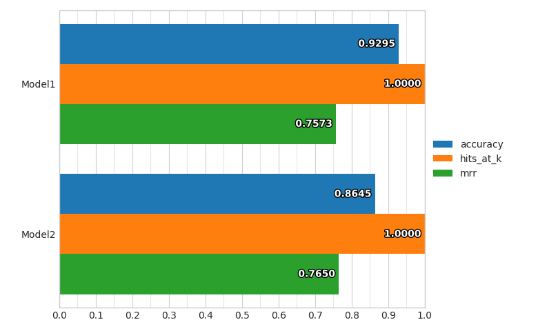


## compare_classifiers_performance_from_pred

Parameters for this visualization: 

* `ground_truth`
* `split_file`
* `ground_truth_metadata`
* `output_directory`
* `file_format`
* `output_feature_name`
* `ground_truth_split`
* `predictions`
* `model_names`
* `labels_limit`

`output_feature_name` needs to be a category.
For each model (in the aligned lists of `predictions` and `model_names`) it produces bars in a bar plot, one for each overall metric computed on the fly from the predictions for the specified `output_feature_name`.

Example command:
```
ludwig visualize --visualization compare_classifiers_performance_from_pred \
  --ground_truth train.hdf5 \
  --ground_truth_metadata train.json \
  --output_feature_name Survived \
  --predictions results/titanic_Model1_0/Survived_predictions.csv \
        results/titanic_Model2_0/Survived_predictions.csv \
  --model_names Model1 Model2 
```


## compare_classifiers_performance_subset

Parameters for this visualization: 

* `ground_truth`
* `split_file`
* `ground_truth_metadata`
* `output_directory`
* `file_format`
* `output_feature_name`
* `ground_truth_split` 
* `probabilities`
* `model_names`
* `top_n_classes`
* `labels_limit`
* `subset`

`output_feature_name` needs to be a category.
For each model (in the aligned lists of `predictions` and `model_names`) it produces bars in a bar plot, one for each overall metric computed on the fly from the probabilities predictions for the specified `output_feature_name`, considering only a subset of the full training set.
The way the subset is obtained is using the `top_n_classes` and `subset` parameters.

If the values of `subset` is `ground_truth`, then only datapoints where the ground truth class is within the top `n` most frequent ones will be considered as test set, and the percentage of datapoints that have been kept from the original set will be displayed.

Example command:
```
ludwig visualize --visualization compare_classifiers_performance_subset \
  --ground_truth train.hdf5 \
  --ground_truth_metadata train.json \
  --output_feature_name Survived \
  --probabilities results/titanic_Model1_0/Survived_probabilities.csv \
           results/titanic_Model2_0/Survived_probabilities.csv \
  --model_names Model1 Model2 \
  --top_n_classes 2 \
  --subset ground_truth 
```


If the values of `subset` is `predictions`, then only datapoints where the the model predicts a class that is within the top `n` most frequent ones will be considered as test set, and the percentage of datapoints that have been kept from the original set will be displayed for each model.


## compare_classifiers_performance_changing_k

Parameters for this visualization: 

* `ground_truth`
* `split_file`
* `ground_truth_metadata`
* `output_directory` 
* `file_format`
* `output_feature_name`
* `ground_truth_split`
* `probabilities`
* `model_names`
* `top_k`
* `labels_limit`

`output_feature_name` needs to be a category.
For each model (in the aligned lists of `probabilities` and `model_names`) it produces a line plot that shows the Hits@K measure (that counts a prediction as correct if the model produces it among the first `k`) while changing `k` from 1 to `top_k` for the specified `output_feature_name`.

Example command:
```
ludwig visualize --visualization compare_classifiers_performance_changing_k \
  --ground_truth train.hdf5 \
  --output_feature_name Survived \
  --probabilities results/titanic_Model1_0/Survived_probabilities.csv \
         results/titanic_Model2_0/Survived_probabilities.csv \
  --model_names Model1 Model2 \
  --top_k 5 
```


## compare_classifiers_multiclass_multimetric

Parameters for this visualization: 

* `ground_truth_metadata`
* `output_directory`
* `file_format`
* `output_feature_name`
* `test_statistics`
* `model_names`
* `top_n_classes`

`output_feature_name` needs to be a category.
For each model (in the aligned lists of `test_statistics` and `model_names`) it produces four plots that show the precision, recall and F1 of the model on several classes for the specified `output_feature_name`.

The first one show the measures on the `n` most frequent classes.

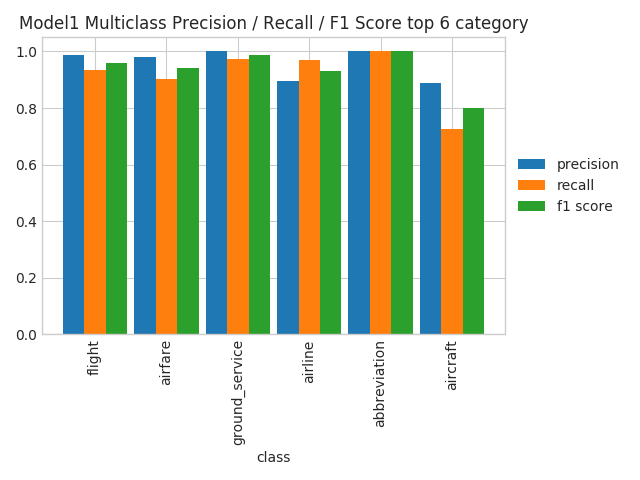

The second one shows the measures on the `n` classes where the model performs the best.


The third one shows the measures on the `n` classes where the model performs the worst.

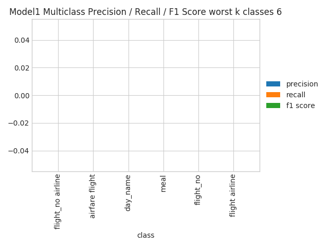

The fourth one shows the measures on all the classes, sorted by their frequency. This could become unreadable in case the number of classes is really high.


Compare Classifier Predictions
==============================

## compare_classifiers_predictions

Parameters for this visualization: 

* `ground_truth`
* `split_file`
* `ground_truth_metadata`
* `output_directory` 
* `file_format`
* `output_feature_name`
* `ground_truth_split`
* `predictions`
* `model_names`
* `labels_limit`

`output_feature_name` needs to be a category and there must be two and only two models (in the aligned lists of `predictions` and `model_names`).
This visualization produces a pie chart comparing the predictions of the two models for the specified `output_feature_name`.

Example command:
```
ludwig visualize --visualization compare_classifiers_predictions \
  --ground_truth train.hdf5 \
  --output_feature_name Survived \
  --predictions results/titanic_Model1_0/Survived_predictions.csv \
          results/titanic_Model2_0/Survived_predictions.csv \
  --model_names Model1 Model2 
```
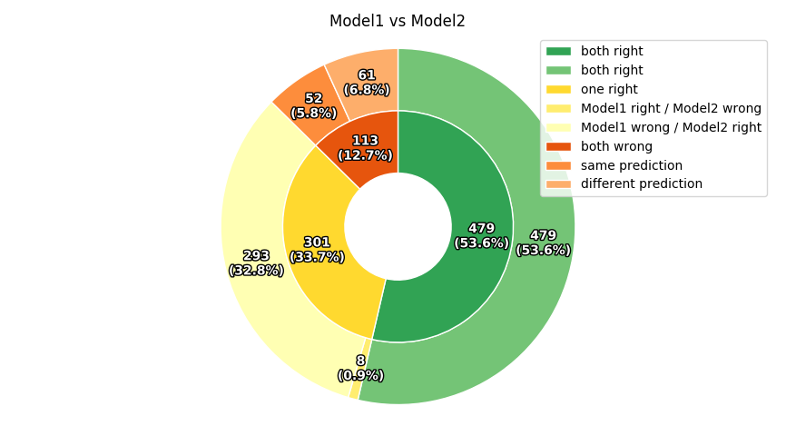


## compare_classifiers_predictions_distribution

Parameters for this visualization: 

* `ground_truth`
* `split_file`
* `ground_truth_metadata`
* `output_directory`
* `file_format`
* `output_feature_name`
* `ground_truth_split`
* `predictions`
* `model_names`
* `label_limits`

`output_feature_name` needs to be a category.
This visualization produces a radar plot comparing the distributions of predictions of the models for the first 10 classes of the specified `output_feature_name`.

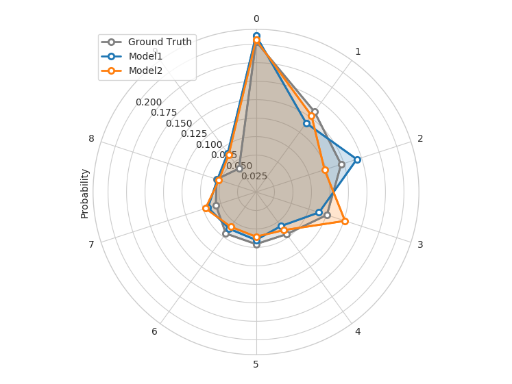


Confidence Thresholding
=======================

## confidence_thresholding

Parameters for this visualization: 

* `ground_truth`
* `split_file`
* `ground_truth_metadata`
* `output_directory`
* `file_format`
* `output_feature_name`
* `ground_truth_split`
* `probabilities`
* `model_names`
* `labels_limit`

`output_feature_name` needs to be a category.
For each model (in the aligned lists of `probabilities` and `model_names`) it produces a pair of lines indicating the accuracy of the model and the data coverage while increasing a threshold (x axis) on the probabilities of predictions for the specified `output_feature_name`.


## confidence_thresholding_data_vs_acc

Parameters for this visualization: 

* `ground_truth`
* `split_file`
* `ground_truth_metadata`
* `output_directory`
* `file_format`
* `output_feature_name`
* `ground_truth_split`
* `probabilities`
* `model_names`
* `labels_limit`

`output_feature_name` needs to be a category.
For each model (in the aligned lists of `probabilities` and `model_names`) it produces a line indicating the accuracy of the model and the data coverage while increasing a threshold on the probabilities of predictions for the specified `output_feature_name`.
The difference with `confidence_thresholding` is that it uses two axes instead of three, not visualizing the threshold and having coverage as x axis instead of the threshold.

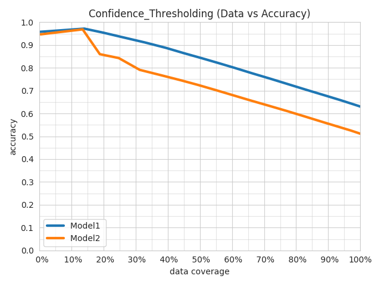


## confidence_thresholding_data_vs_acc_subset

Parameters for this visualization: 

* `ground_truth`
* `split_file`
* `ground_truth_metadata`
* `output_directory`
* `file_format`
* `output_feature_name`
* `ground_truth_split`
* `probabilities`
* `model_names`
* `top_n_classes`
* `labels_limit`
* `subset`

`output_feature_name` needs to be a category.
For each model (in the aligned lists of `probabilities` and `model_names`) it produces a line indicating the accuracy of the model and the data coverage while increasing a threshold on the probabilities of predictions for the specified `output_feature_name`, considering only a subset of the full training set.
The way the subset is obtained is using the `top_n_classes` and `subset` parameters..
The difference with `confidence_thresholding` is that it uses two axes instead of three, not visualizing the threshold and having coverage as x axis instead of the threshold.

If the values of `subset` is `ground_truth`, then only datapoints where the ground truth class is within the top `n` most frequent ones will be considered as test set, and the percentage of datapoints that have been kept from the original set will be displayed.
If the values of `subset` is `predictions`, then only datapoints where the the model predicts a class that is within the top `n` most frequent ones will be considered as test set, and the percentage of datapoints that have been kept from the original set will be displayed for each model.


## confidence_thresholding_data_vs_acc_subset_per_class

Parameters for this visualization: 

* `ground_truth`
* `split_file`
* `ground_truth_metadata`
* `output_directory`
* `file_format`
* `output_feature_name`
* `ground_truth_split`
* `probabilities`
* `model_names`
* `top_n_classes`
* `labels_limit`
* `subset`

`output_feature_name` needs to be a category.
For each model (in the aligned lists of `probabilities` and `model_names`) it produces a line indicating the accuracy of the model and the data coverage while increasing a threshold on the probabilities of predictions for the specified `output_feature_name`, considering only a subset of the full training set.
The way the subset is obtained is using the `top_n_classes` and `subset` parameters..
The difference with `confidence_thresholding` is that it uses two axes instead of three, not visualizing the threshold and having coverage as x axis instead of the threshold.

If the values of `subset` is `ground_truth`, then only datapoints where the ground truth class is within the top `n` most frequent ones will be considered as test set, and the percentage of datapoints that have been kept from the original set will be displayed.
If the values of `subset` is `predictions`, then only datapoints where the the model predicts a class that is within the top `n` most frequent ones will be considered as test set, and the percentage of datapoints that have been kept from the original set will be displayed for each model.

The difference with `confidence_thresholding_data_vs_acc_subset` is that it produces one plot per class within the `top_n_classes`.


## confidence_thresholding_2thresholds_2d

Parameters for this visualization: 

* `ground_truth`
* `split_file`
* `ground_truth_metadata`
* `output_directory`
* `file_format`
* `ground_truth_split`
* `threshold_output_feature_names`
* `probabilities`
* `model_names`
* `labels_limit`

`threshold_output_feature_names` need to be exactly two, either category or binary.
`probabilities` need to be exactly two, aligned with `threshold_output_feature_names`.
`model_names` has to be exactly one.
Three plots are produced.

The first plot shows several semi transparent lines.
They summarize the 3d surfaces displayed by `confidence_thresholding_2thresholds_3d` that have thresholds on the confidence of the predictions of the two `threshold_output_feature_names` as x and y axes and either the data coverage percentage or the accuracy as z axis.
Each line represents a slice of the data coverage surface projected onto the accuracy surface.

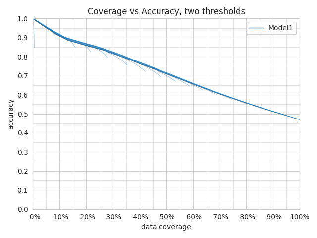

The second plot shows the max of all the lines displayed in the first plot.

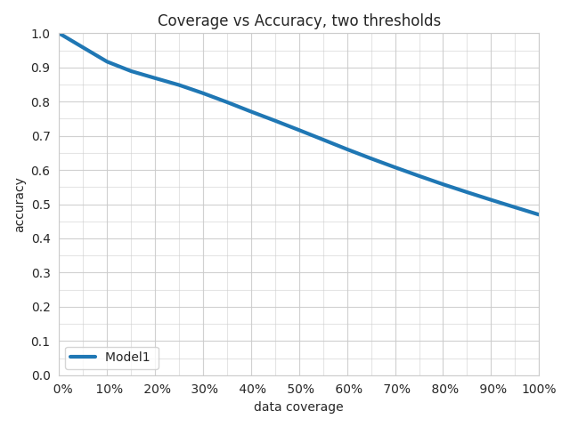

The third plot shows the max line and the values of the thresholds that obtained a specific data coverage vs accuracy pair of values.


## confidence_thresholding_2thresholds_3d

Parameters for this visualization: 

* `ground_truth`
* `split_file`
* `ground_truth_metadata`
* `output_directory`
* `file_format`
* `ground_truth_split`
* `threshold_output_feature_names`
* `probabilities`
* `labels_limit`

`threshold_output_feature_names` need to be exactly two, either category or binary.
`probabilities` need to be exactly two, aligned with `threshold_output_feature_names`.
The plot shows the 3d surfaces displayed by `confidence_thresholding_2thresholds_3d` that have thresholds on the confidence of the predictions of the two `threshold_output_feature_names` as x and y axes and either the data coverage percentage or the accuracy as z axis.

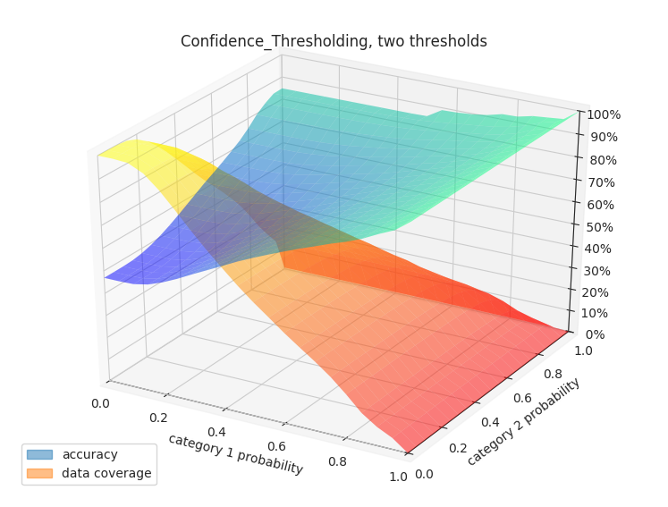


Binary Threshold vs. Metric
===========================

## binary_threshold_vs_metric

Parameters for this visualization: 

* `ground_truth`
* `split_file`
* `ground_truth_metadata`
* `output_directory`
* `file_format`
* `output_feature_name`
* `ground_truth_split`
* `probabilities`
* `model_names`
* `metrics`
* `positive_label`

`output_feature_name` can be a category or binary feature.
For each metric specified in `metrics` (options are `f1`, `precision`, `recall`, `accuracy`), this visualization produces a line chart plotting a threshold on the confidence of the model against the metric for the specified `output_feature_name`.
If `output_feature_name` is a category feature, `positive_label` indicates which is the class to be considered positive class and all the others will be considered negative.
It needs to be an integer, to figure out the association between classes and integers check the `ground_truth_metadata` JSON file.

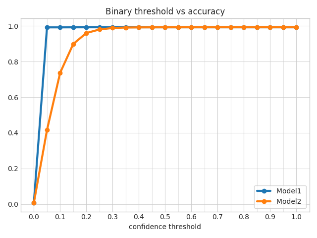


ROC Curves
==========

## roc_curves

Parameters for this visualization: 

* `ground_truth`
* `split_file`
* `ground_truth_metadata`
* `output_directory`
* `file_format`
* `output_feature_name`
* `ground_truth_split`
* `probabilities`
* `model_names`
* `positive_label`

`output_feature_name` can be a category or binary feature.
This visualization produces a line chart plotting the roc curves for the specified `output_feature_name`.
If `output_feature_name` is a category feature, `positive_label` indicates which is the class to be considered positive class and all the others will be considered negative.
It needs to be an integer, to figure out the association between classes and integers check the `ground_truth_metadata` JSON file.


## roc_curves_from_test_statistics

Parameters for this visualization: 

* `output_directory`
* `file_format`
* `output_feature_name`
* `test_statistics`
* `model_names`

`output_feature_name` needs to be binary feature.
This visualization produces a line chart plotting the roc curves for the specified `output_feature_name`.

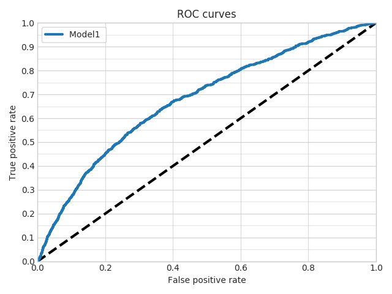


Calibration Plot
================

## calibration_1_vs_all

Parameters for this visualization: 

* `ground_truth`
* `split_file`
* `ground_truth_metadata`
* `output_directory`
* `file_format`
* `output_feature_name`
* `ground_truth_split`
* `probabilities`
* `model_names`
* `top_n_classes`
* `labels_limit`

`output_feature_name` needs to be a category or binary.
For each class or each of the `n` most frequent classes if `top_n_classes` is specified, it produces two plots computed on the fly from the probabilities of predictions for the specified `output_feature_name`.

The first plot is a calibration curve that shows the calibration of the predictions considering the current class to be the true one and all others to be a false one, drawing one line for each model (in the aligned lists of `probabilities` and `model_names`).


The second plot shows the distributions of the predictions considering the current class to be the true one and all others to be a false one, drawing the distribution for each model (in the aligned lists of `probabilities` and `model_names`).


## calibration_multiclass

Parameters for this visualization: 

* `ground_truth`
* `split_file`
* `ground_truth_metadata`
* `output_directory`
* `file_format`
* `output_feature_name`
* `ground_truth_split`
* `probabilities`
* `model_names`
* `labels_limit`

`output_feature_name` needs to be a category.
For each class, produces two plots computed on the fly from the probabilities of predictions for the specified `output_feature_name`.

The first plot is a calibration curve that shows the calibration of the predictions considering al classes, drawing one line for each model (in the aligned lists of `probabilities` and `model_names`).

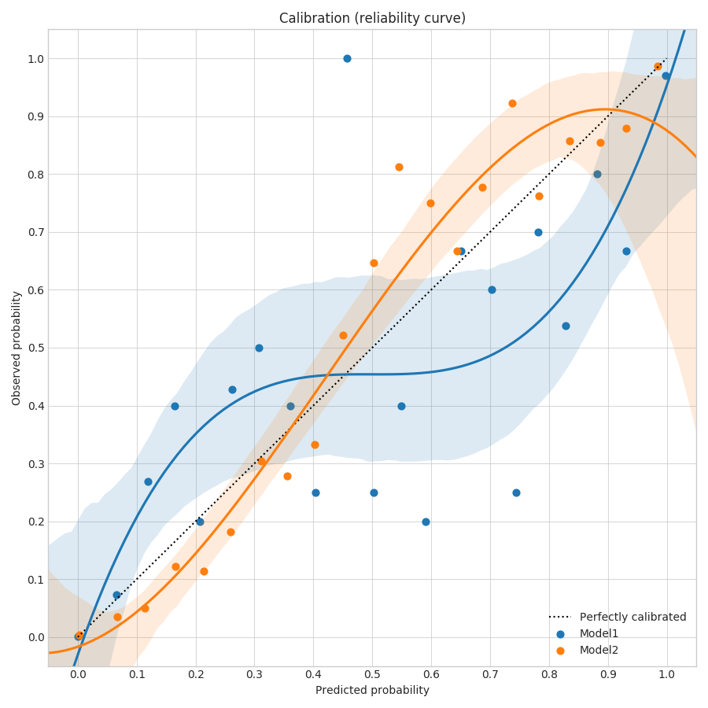

The second plot shows a bar plot of the brier score (that calculates how calibrated are the probabilities of the predictions of a model), drawing one bar for each model (in the aligned lists of `probabilities` and `model_names`).


Class Frequency vs. F1 score
============================

## frequency_vs_f1

Parameters for this visualization: 

* `ground_truth_metadata`
* `output_directory`
* `file_format`
* `output_feature_name`
* `test_statistics`
* `model_names`
* `top_n_classes`

`output_feature_name` needs to be a category.
For each model (in the aligned lists of `test_statistics` and `model_names`), produces two plots statistics of predictions for the specified `output_feature_name`.

Generates plots for `top_n_classes`.  The first plot is a line plot with one x axis representing the different classes and two vertical axes colored in orange and blue respectively.
The orange one is the frequency of the class and an orange line is plotted to show the trend.
The blue one is the F1 score for that class and a blue line is plotted to show the trend. 
The classes on the x axis are sorted by f1 score.

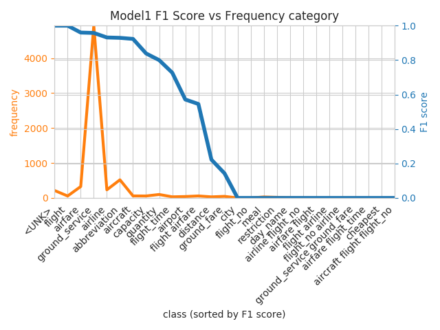

The second plot has the same structure of the first one, but the axes are flipped and the classes on the x axis are sorted by frequency.

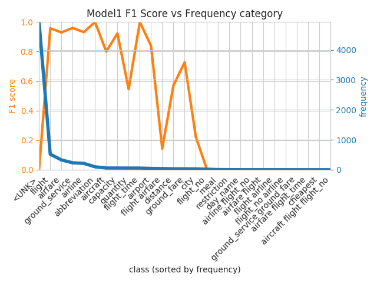


Hyper-parameter optimization visualization
------------------------------------------

The examples of the hyper-parameter visualizations shown here are obtained by running a random search with 100 samples on the [ATIS dataset](https://www.kaggle.com/siddhadev/ms-cntk-atis) used for classifying intents given user utterances.
 
## hyperopt_report

Parameters for this visualization: 

* `output_directory`
* `file_format`
* `hyperopt_stats_path`

The visualization creates one plot for each hyper-parameter in the file at `hyperopt_stats_path`, plus an additional one containing a pair plot of hyper-parameters interactions.

Each plot will show the distribution of the parameters with respect to the metric to optimize.
For `float` and `int` parameters, a scatter plot is used, while for `category` parameters, a violin plot is used instead. 

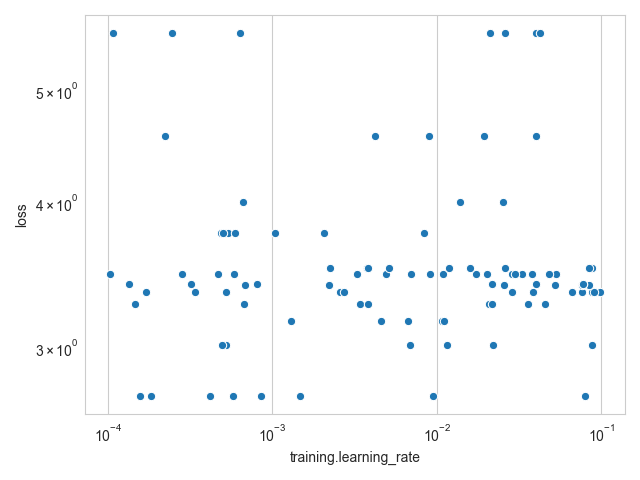

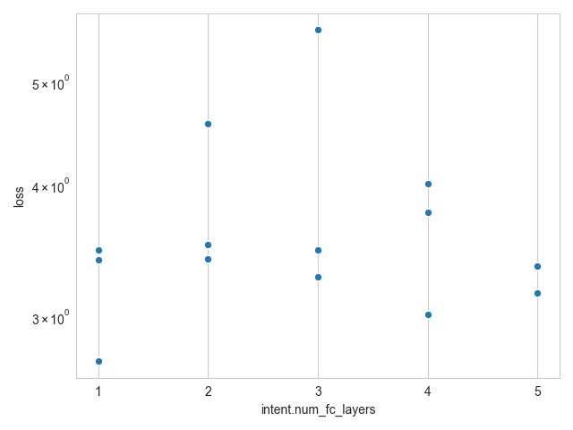


The pair plot shows a heatmap of how the values of pairs of hyper-parameters correlate with the metric to optimize.


## hyperopt_hiplot

Parameters for this visualization: 

* `output_directory`
* `file_format`
* `hyperopt_stats_path`

The visualization creates an interactive HTML page visualizing all the results from the hyper-parameter optimization at once, using a parallel coordinate plot.

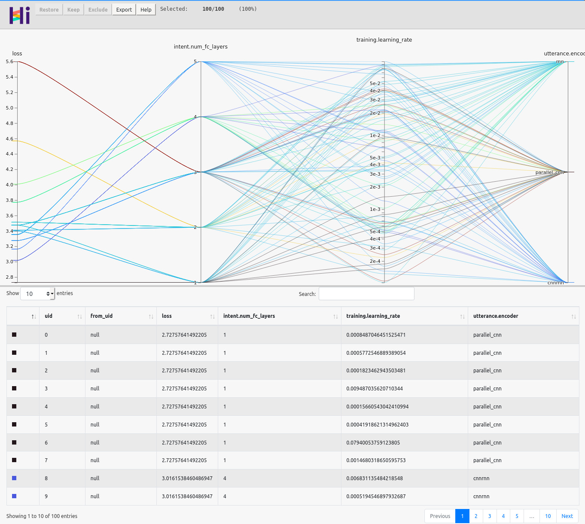
