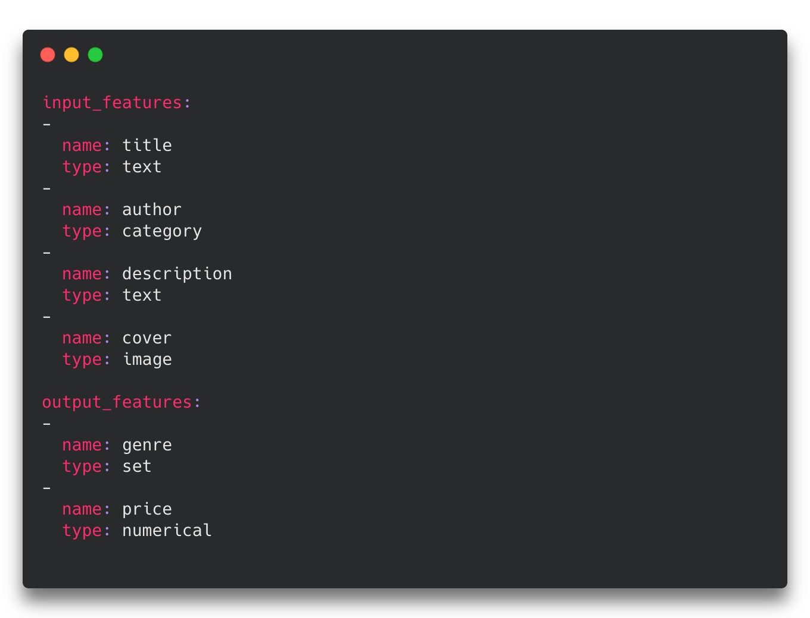
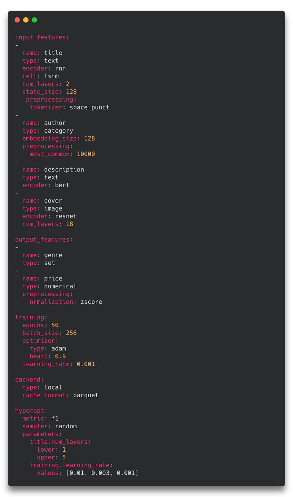
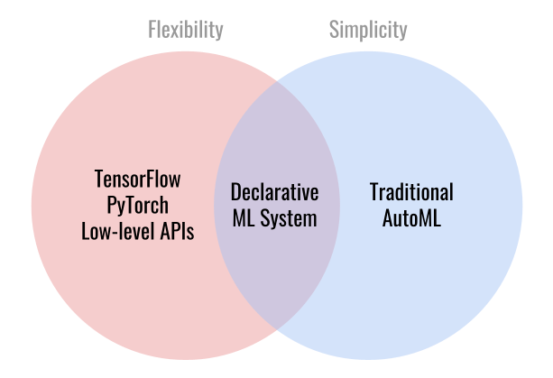

Ludwig is an open-source declarative framework that makes it easy to train and test deep learning models.
It was created and open sourced by Uber and is hosted by the LF AI & Data Foundation.

Ludwig enables you to apply state-of-the-art tabular, natural language processing, and computer vision models to your existing data and put them into production with just a [few short commands](../command_line_interface).

=== "CLI"

    ```sh
    ludwig train --config config.yaml --dataset data.csv
    ludwig predict --model_path results/experiment_run/model --dataset test.csv
    ```

=== "Python"

    ```python
    from ludwig.api import LudwigModel

    # train a model
    config = {...}
    model = LudwigModel(config)
    train_stats = model.train(training_data)

    # or load a model
    model = LudwigModel.load(model_path)

    # obtain predictions
    predictions = model.predict(test_data)
    ```

=== "data.csv"

    ```
    sepal_length_cm,sepal_width_cm,petal_length_cm,petal_width_cm
    4.9,3.0,1.4,0.2
    4.7,3.2,1.3,0.2
    4.6,3.1,1.5,0.2
    5.0,3.6,1.4,0.2
    5.4,3.9,1.7,0.4
    4.6,3.4,1.4,0.3
    5.0,3.4,1.5,0.2
    4.4,2.9,1.4,0.2
    4.9,3.1,1.5,0.1
    ```

=== "config.yaml"

    ```yaml
    input_features:
        - name: sepal_length_cm
        type: number
        - name: sepal_width_cm
        type: number
        - name: petal_length_cm
        type: number
        - name: petal_width_cm
        type: number
    output_features:
        - name: class
        type: category
    ```

Ludwig makes this possible through its **declarative** approach to structuring machine learning pipelines. Instead of writing code for your model, training loop, preprocessing, postprocessing, evaluation and hyperparameter optimization, you only need to declare the schema of your data with a simple YAML configuration:



Starting from a simple config like the one above, any and all aspects of the model architecture, training loop, hyperparameter search, and backend infrastructure can be modified as additional fields in the declarative configuration to customize the pipeline to meet your requirements:



Ludwig is a single framework that guides you through machine learning end-to-end; from experimenting with different training recipes, exploring state-of-the-art model architectures, to scaling up to large out-of-memory datasets and multi-node clusters, and finally serving the best model in production.

# Why Declarative Machine Learning Systems



Ludwig’s declarative approach to machine learning provides the simplicity of an AutoML solution with the flexibility of full-featured frameworks like TensorFlow and PyTorch.
This is achieved by creating an extensible, declarative configuration with optional parameters for every aspect of the pipeline.

Ludwig’s declarative programming model allows for key features such as:

- **Multi-modal, multi-task learning out-of-the-box.** Mix and match tabular data, text, images, and even audio into complex model configurations without writing code.
- **Integration with any structured data source.** If it can be read into a SQL table or Pandas DataFrame, Ludwig can train a model on it.
- **Easily explore different model configurations and parameters with hyperopt.** Automatically track all trials and metrics with tools like Comet ML, Weights & Biases, and MLflow.
- **Automatically scale training to multi-GPU, multi-node clusters.** Go from training on your local machine to the cloud without code or config changes.
- **Fully customize any part of the training process.** Every part of the model and training process is fully configurable in YAML, and easy to extend through custom PyTorch modules with a simple interface.
